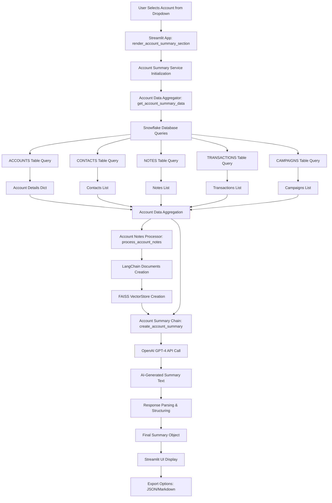
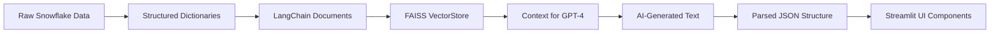
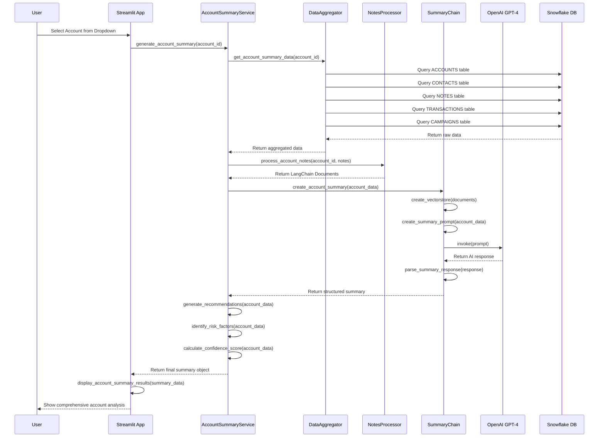

# 🚀 Account Summary AI Implementation Plan

## 📋 Project Overview
Implement AI-powered Account Summary generation using LangChain framework, leveraging existing components and Snowflake data.

## 🏗️ Implementation Status

### ✅ Phase 1: Foundation Setup
- [x] <span style="background-color: #ffebee; border: 2px solid #f44336; padding: 4px 8px; border-radius: 4px; color: #c62828; font-weight: bold;">Analyze existing components structure</span>
- [x] <span style="background-color: #e3f2fd; border: 2px solid #2196f3; padding: 4px 8px; border-radius: 4px; color: #1565c0; font-weight: bold;">Review NOTES table schema and data</span>
- [x] <span style="background-color: #e3f2fd; border: 2px solid #2196f3; padding: 4px 8px; border-radius: 4px; color: #1565c0; font-weight: bold;">Create implementation plan</span>
- [x] <span style="background-color: #e3f2fd; border: 2px solid #2196f3; padding: 4px 8px; border-radius: 4px; color: #1565c0; font-weight: bold;">Set up project structure</span>

### ✅ Phase 2: Core Components (Completed)
- [x] <span style="background-color: #ffebee; border: 2px solid #f44336; padding: 4px 8px; border-radius: 4px; color: #c62828; font-weight: bold;">Create Account Data Aggregator</span>
- [x] <span style="background-color: #ffebee; border: 2px solid #f44336; padding: 4px 8px; border-radius: 4px; color: #c62828; font-weight: bold;">Create Account Notes Processor</span>
- [x] <span style="background-color: #ffebee; border: 2px solid #f44336; padding: 4px 8px; border-radius: 4px; color: #c62828; font-weight: bold;">Create Account Summary Chain</span>
- [x] <span style="background-color: #ffebee; border: 2px solid #f44336; padding: 4px 8px; border-radius: 4px; color: #c62828; font-weight: bold;">Create Account Summary Service</span>

### ✅ Phase 3: Integration & Dashboard (Completed)
- [x] <span style="background-color: #e8f5e8; border: 2px solid #4caf50; padding: 4px 8px; border-radius: 4px; color: #2e7d32; font-weight: bold;">Create Streamlit dashboard</span>
- [x] <span style="background-color: #e3f2fd; border: 2px solid #2196f3; padding: 4px 8px; border-radius: 4px; color: #1565c0; font-weight: bold;">Add comprehensive error handling and logging</span>
- [x] <span style="background-color: #e3f2fd; border: 2px solid #2196f3; padding: 4px 8px; border-radius: 4px; color: #1565c0; font-weight: bold;">Create test suite</span>

### ⏳ Phase 4: Testing & Optimization
- [ ] <span style="background-color: #fff3e0; border: 2px solid #ff9800; padding: 4px 8px; border-radius: 4px; color: #e65100; font-weight: bold;">Unit tests</span>
- [ ] <span style="background-color: #fff3e0; border: 2px solid #ff9800; padding: 4px 8px; border-radius: 4px; color: #e65100; font-weight: bold;">Integration tests</span>
- [ ] <span style="background-color: #fff3e0; border: 2px solid #ff9800; padding: 4px 8px; border-radius: 4px; color: #e65100; font-weight: bold;">Performance optimization</span>

---

## 📁 Project Structure

```
src/pmi_retail/
├── agents/
│   ├── components/           # Existing components
│   │   ├── chat_chain.py
│   │   ├── pdf_processor.py
│   │   └── vectorstore.py
│   ├── account_summary/      # NEW: Account summary components
│   │   ├── __init__.py
│   │   ├── data_aggregator.py
│   │   ├── notes_processor.py
│   │   ├── summary_chain.py
│   │   └── summary_service.py
│   └── __init__.py
├── database/
│   └── snowflake/
│       ├── connection.py
│       └── table_builder.py
├── config/
│   └── __init__.py
└── utils/
    └── data_generator.py

streamlit_apps/
├── dashboards/
│   └── account_summary_dashboard.py  # NEW
└── demos/

tests/
├── unit/
│   └── test_account_summary/         # NEW
└── integration/
    └── test_account_summary/         # NEW
```

---

## 🔧 Implementation Steps

### Step 1: Create Account Summary Package Structure
**Status**: ✅ Completed
**Files Created**:
- `src/pmi_retail/agents/account_summary/__init__.py` ✅
- `src/pmi_retail/agents/account_summary/data_aggregator.py` ✅
- `src/pmi_retail/agents/account_summary/notes_processor.py` ✅
- `src/pmi_retail/agents/account_summary/summary_chain.py` ✅
- `src/pmi_retail/agents/account_summary/summary_service.py` ✅

### Step 2: Implement Account Data Aggregator
**Status**: ✅ Completed
**Purpose**: Aggregate all account-related data from multiple Snowflake tables
**Key Methods Implemented**:
- `get_account_summary_data(account_id: str) -> Dict` ✅
- `get_account_notes(account_id: str) -> List[Dict]` ✅
- `get_account_contacts(account_id: str) -> List[Dict]` ✅
- `get_account_transactions(account_id: str) -> List[Dict]` ✅
- `get_account_campaigns(account_id: str) -> List[Dict]` ✅
- `get_account_list() -> List[Dict]` ✅
- `validate_account_id(account_id: str) -> bool` ✅

### Step 3: Implement Account Notes Processor
**Status**: ✅ Completed
**Purpose**: Process and structure notes for LLM consumption
**Key Methods Implemented**:
- `process_account_notes(account_id: str, notes: List[Dict]) -> List[Document]` ✅
- `categorize_notes(notes: List[Dict]) -> Dict[str, List]` ✅
- `extract_key_insights(notes: List[Dict]) -> List[str]` ✅
- `generate_notes_summary(notes: List[Dict]) -> str` ✅

### Step 4: Implement Account Summary Chain
**Status**: ✅ Completed
**Purpose**: LangChain-based summary generation using OpenAI
**Key Methods Implemented**:
- `create_account_summary(account_data: Dict) -> Dict[str, Any]` ✅
- `create_vectorstore(documents: List[Document]) -> FAISS` ✅
- `create_qa_chain() -> RetrievalQA` ✅
- `_create_summary_prompt(account_data: Dict) -> str` ✅
- `_parse_summary_response(response_text: str) -> Dict[str, Any]` ✅

### Step 5: Implement Account Summary Service
**Status**: ✅ Completed
**Purpose**: Main orchestrator service
**Key Methods Implemented**:
- `generate_account_summary(account_id: str) -> Dict[str, Any]` ✅
- `get_account_list() -> List[Dict]` ✅
- `validate_account_id(account_id: str) -> bool` ✅
- `get_service_status() -> Dict[str, Any]` ✅

### Step 6: Create Streamlit Dashboard
**Status**: ✅ Completed
**Purpose**: Interactive UI for account summary generation
**Features Implemented**:
- Account selection dropdown ✅
- AI summary generation ✅
- Key insights display ✅
- Recommendations display ✅
- Export functionality (JSON & Markdown) ✅
- Service status monitoring ✅
- Real-time progress indicators ✅

---

## 📊 Technical Workflow & Data Flow

### **Complete Account Summary Generation Workflow**



### **Detailed Technical Implementation Flow**

#### **1. User Interaction (Streamlit Frontend)**
```python
# User selects account from dropdown
selected_display = st.selectbox("Choose an account to analyze:", options=account_options.keys())
selected_account_id = account_options[selected_display]

# User clicks "Generate AI Summary" button
if st.button("🤖 Generate AI Summary", type="primary"):
    summary_data = st.session_state.account_summary_service.generate_account_summary(selected_account_id)
```

#### **2. Service Orchestration (AccountSummaryService)**
```python
def generate_account_summary(self, account_id: str) -> Dict[str, Any]:
    # Step 1: Validate account ID
    if not self.validate_account_id(account_id):
        return {'error': f'Account ID {account_id} not found'}
    
    # Step 2: Aggregate all account data
    account_data = self.data_aggregator.get_account_summary_data(account_id)
    
    # Step 3: Process notes for vectorstore
    notes_documents = self.notes_processor.process_account_notes(account_id, notes)
    
    # Step 4: Create vectorstore for enhanced context
    vectorstore = self.summary_chain.create_vectorstore(notes_documents)
    
    # Step 5: Generate AI summary
    ai_summary = self.summary_chain.create_account_summary(account_data)
    
    # Step 6: Compile final summary with metadata
    return final_summary
```

#### **3. Data Aggregation (AccountDataAggregator)**
```python
def get_account_summary_data(self, account_id: str) -> Dict[str, Any]:
    # Parallel data fetching from multiple Snowflake tables
    account_details = self.get_account_details(account_id)      # ACCOUNTS table
    contacts = self.get_account_contacts(account_id)           # CONTACTS table  
    notes = self.get_account_notes(account_id)                 # NOTES table
    transactions = self.get_account_transactions(account_id)   # TRANSACTIONS table
    campaigns = self.get_account_campaigns(account_id)         # CAMPAIGNS table
    
    return {
        'account_id': account_id,
        'account_details': account_details,
        'contacts': contacts,
        'notes': notes,
        'transactions': transactions,
        'campaigns': campaigns,
        'aggregated_at': datetime.now().isoformat()
    }
```

#### **4. Notes Processing (AccountNotesProcessor)**
```python
def process_account_notes(self, account_id: str, notes: List[Dict]) -> List[Document]:
    documents = []
    for note in notes:
        # Create structured content for LLM processing
        content = self._format_note_content(note)
        
        # Create LangChain Document with metadata
        doc = Document(
            page_content=content,
            metadata={
                'account_id': account_id,
                'note_id': note['note_id'],
                'note_type': note['note_type'],
                'category': note['note_category'],
                'priority': note['note_priority'],
                'created_by': note['created_by'],
                'source': 'account_notes'
            }
        )
        documents.append(doc)
    return documents
```

#### **5. AI Summary Generation (AccountSummaryChain)**
```python
def create_account_summary(self, account_data: Dict[str, Any]) -> Dict[str, Any]:
    # Create comprehensive prompt with all account data
    prompt = self._create_summary_prompt(account_data)
    
    # Call OpenAI GPT-4 API
    response = self.llm.invoke(prompt)
    summary_text = response.content
    
    # Parse and structure the response
    structured_summary = self._parse_summary_response(summary_text, account_data)
    
    return structured_summary
```

#### **6. Prompt Engineering & Context Building**
```python
def _create_summary_prompt(self, account_data: Dict[str, Any]) -> str:
    # Format all account data into structured prompt
    account_info = self._format_account_info(account_data['account_details'])
    contacts_summary = self._format_contacts_summary(account_data['contacts'])
    notes_summary = self._format_notes_summary(account_data['notes'])
    transactions_summary = self._format_transactions_summary(account_data['transactions'])
    campaigns_summary = self._format_campaigns_summary(account_data['campaigns'])
    
    # Create comprehensive prompt for GPT-4
    prompt = f"""
    You are an expert retail account analyst. Generate a comprehensive analysis for:
    
    ## ACCOUNT INFORMATION
    {account_info}
    
    ## CONTACTS SUMMARY
    {contacts_summary}
    
    ## NOTES & COMMUNICATIONS
    {notes_summary}
    
    ## TRANSACTION HISTORY
    {transactions_summary}
    
    ## CAMPAIGN ACTIVITY
    {campaigns_summary}
    
    Provide analysis in structured format with:
    1. Executive Summary
    2. Business Insights
    3. Relationship Status
    4. Revenue Opportunities
    5. Risk Factors
    6. Recommended Actions
    """
    return prompt
```

#### **7. Response Processing & UI Display**
```python
def display_account_summary_results(summary_data):
    # Display metadata metrics
    col1, col2, col3, col4 = st.columns(4)
    with col1:
        st.metric("Confidence Score", f"{metadata['confidence_score']:.1%}")
    
    # Display AI-generated sections
    if ai_summary.get('executive_summary'):
        st.markdown("### 🎯 Executive Summary")
        st.info(ai_summary['executive_summary'])
    
    # Display business insights, recommendations, etc.
    for insight in ai_summary['business_insights']:
        st.markdown(f"• {insight}")
```

### **Data Transformation Pipeline**



### **Context Flow Architecture**



### **Context Passing & Data Flow Details**

#### **Step-by-Step Context Flow:**

1. **User Selection Context:**
   ```python
   # Streamlit captures user selection
   selected_account_id = "ACC0001"  # Example account ID
   ```

2. **Service Initialization Context:**
   ```python
   # Service receives configuration from Streamlit sidebar
   service = AccountSummaryService(
       model_name=config["llm_model"],      # "gpt-4"
       temperature=config["temperature"],   # 0.1
       max_tokens=config["max_tokens"]      # 2000
   )
   ```

3. **Database Query Context:**
   ```sql
   -- Multiple parallel queries executed
   SELECT * FROM ACCOUNTS WHERE ACCOUNT_ID = 'ACC0001';
   SELECT * FROM CONTACTS WHERE ACCOUNT_ID = 'ACC0001';
   SELECT * FROM NOTES WHERE ACCOUNT_ID = 'ACC0001';
   SELECT * FROM TRANSACTIONS WHERE ACCOUNT_ID = 'ACC0001';
   SELECT * FROM CAMPAIGNS WHERE CAMPAIGN_ID IN (
       SELECT DISTINCT CAMPAIGN_ID FROM TRANSACTIONS WHERE ACCOUNT_ID = 'ACC0001'
   );
   ```

4. **Data Aggregation Context:**
   ```python
   # Raw data transformed into structured format
   account_data = {
       'account_id': 'ACC0001',
       'account_details': {
           'account_name': 'Quick Stop Northeast Region',
           'segment': 'Premium',
           'annual_revenue': 2500000.0,
           'employee_count': 150
       },
       'contacts': [
           {'contact_id': 'CON0001', 'first_name': 'John', 'last_name': 'Smith', 'job_title': 'CEO'},
           {'contact_id': 'CON0002', 'first_name': 'Jane', 'last_name': 'Doe', 'job_title': 'CFO'}
       ],
       'notes': [
           {'note_id': 'NOTE001', 'note_type': 'Account Note', 'subject': 'Quarterly Review', 'note_text': 'Customer expressed satisfaction...'},
           {'note_id': 'NOTE002', 'note_type': 'Contact Note', 'subject': 'Technical Issue', 'note_text': 'Customer reported minor problem...'}
       ],
       'transactions': [
           {'transaction_id': 'TXN001', 'product_name': 'Product A', 'net_amount': 5000.0, 'transaction_date': '2024-08-01'},
           {'transaction_id': 'TXN002', 'product_name': 'Product B', 'net_amount': 3000.0, 'transaction_date': '2024-08-15'}
       ],
       'campaigns': [
           {'campaign_id': 'CAMP001', 'campaign_name': 'Q3 Promotion', 'status': 'Active', 'budget': 10000.0}
       ]
   }
   ```

5. **Notes Processing Context:**
   ```python
   # Notes converted to LangChain Documents
   documents = [
       Document(
           page_content="Subject: Quarterly Review\nType: Account Note\nCategory: Sales\nContent: Customer expressed satisfaction with our services\nCreated by: John Doe\nDate: 2024-09-01 10:00:00",
           metadata={'account_id': 'ACC0001', 'note_id': 'NOTE001', 'note_type': 'Account Note', 'category': 'Sales', 'priority': 'High', 'source': 'account_notes'}
       ),
       Document(
           page_content="Subject: Technical Issue\nType: Contact Note\nCategory: Support\nContent: Customer reported a minor technical problem\nCreated by: Jane Smith\nDate: 2024-09-02 14:30:00",
           metadata={'account_id': 'ACC0001', 'note_id': 'NOTE002', 'note_type': 'Contact Note', 'category': 'Support', 'priority': 'Medium', 'source': 'account_notes'}
       )
   ]
   ```

6. **VectorStore Context:**
   ```python
   # Documents embedded and stored in FAISS vectorstore
   vectorstore = FAISS.from_documents(documents, embeddings)
   # Enables semantic search for relevant note context
   ```

7. **AI Prompt Context:**
   ```python
   # Comprehensive prompt sent to GPT-4
   prompt = """
   You are an expert retail account analyst. Generate a comprehensive analysis for:
   
   ## ACCOUNT INFORMATION
   Account ID: ACC0001
   Account Name: Quick Stop Northeast Region
   Account Type: Chain Headquarters
   Segment: Premium
   Annual Revenue: $2,500,000.00
   Employee Count: 150
   Status: Active
   Location: Boston, MA
   
   ## CONTACTS SUMMARY
   Total Contacts: 2
   
   Business Contacts (2):
     - John Smith (CEO)
     - Jane Doe (CFO)
   
   ## NOTES & COMMUNICATIONS
   Total Notes: 2
   
   Account Note (1):
     - Quarterly Review (High priority)
   
   Contact Note (1):
     - Technical Issue (Medium priority)
   
   ## TRANSACTION HISTORY
   Total Transactions: 2
   Total Revenue: $8,000.00
   Average Transaction: $4,000.00
   
   By Product Category:
     - Product A: 1 transactions, $5,000.00
     - Product B: 1 transactions, $3,000.00
   
   ## CAMPAIGN ACTIVITY
   Total Campaigns: 1
   
   Marketing Campaigns (1):
     - Q3 Promotion (Active, Budget: $10,000.00)
   
   Provide analysis in structured format with:
   1. Executive Summary
   2. Business Insights
   3. Relationship Status
   4. Revenue Opportunities
   5. Risk Factors
   6. Recommended Actions
   """
   ```

8. **AI Response Context:**
   ```python
   # GPT-4 response parsed into structured format
   ai_summary = {
       'executive_summary': 'Premium chain account with strong revenue potential and active engagement...',
       'business_insights': [
           'High-value customer with $2.5M annual revenue',
           'Active in multiple product categories',
           'Strong executive-level relationships'
       ],
       'relationship_status': 'Strong partnership with regular engagement and high satisfaction',
       'revenue_opportunities': [
           'New product line expansion opportunities',
           'Cross-selling potential with existing products'
       ],
       'risk_factors': [
           'Recent technical issues require monitoring',
           'Competitive pressure in Northeast region'
       ],
       'recommended_actions': [
           'Schedule quarterly business review',
           'Present new product opportunities',
           'Address technical concerns proactively'
       ]
   }
   ```

9. **Final Output Context:**
   ```python
   # Complete summary object with metadata
   final_summary = {
       'account_id': 'ACC0001',
       'account_name': 'Quick Stop Northeast Region',
       'summary': ai_summary,
       'key_insights': ['High priority issues: 1 urgent items requiring attention'],
       'recommendations': ['Schedule quarterly executive business reviews'],
       'risk_factors': ['Customer complaints identified (0 notes)'],
       'metadata': {
           'generated_at': '2024-09-03T13:00:00Z',
           'data_sources': ['ACCOUNTS', 'CONTACTS', 'NOTES', 'TRANSACTIONS', 'CAMPAIGNS'],
           'confidence_score': 0.95,
           'total_notes': 2,
           'total_contacts': 2,
           'total_transactions': 2,
           'model_used': 'gpt-4'
       }
   }
   ```

10. **Streamlit Display Context:**
    ```python
    # UI components render the structured data
    st.metric("Confidence Score", "95.0%")
    st.metric("Total Notes", "2")
    st.metric("Total Contacts", "2")
    st.metric("Total Transactions", "2")
    
    st.info("Premium chain account with strong revenue potential...")
    
    for insight in ai_summary['business_insights']:
        st.markdown(f"• {insight}")
    ```

---

## 🎯 Expected Output Format

```json
{
  "account_id": "ACC0001",
  "account_name": "Quick Stop Northeast Region",
  "summary": {
    "executive_summary": "Premium chain account with strong revenue potential...",
    "business_insights": [
      "High-value customer with $2.5M annual revenue",
      "Active in multiple product categories"
    ],
    "relationship_status": "Strong partnership with regular engagement",
    "revenue_opportunities": [
      "New product line expansion",
      "Cross-selling opportunities"
    ],
    "risk_factors": [
      "Competitor activity in region",
      "Recent service complaints"
    ],
    "recommendations": [
      "Schedule quarterly business review",
      "Present new product opportunities"
    ]
  },
  "metadata": {
    "generated_at": "2024-09-03T13:00:00Z",
    "data_sources": ["ACCOUNTS", "CONTACTS", "NOTES", "TRANSACTIONS"],
    "confidence_score": 0.95
  }
}
```

---

## 🔧 Technical Requirements

### Dependencies
- `langchain` - LLM framework
- `langchain-openai` - OpenAI integration
- `faiss-cpu` - Vector similarity search
- `streamlit` - Dashboard UI
- `pandas` - Data processing
- `snowflake-connector-python` - Database connection

### Environment Variables
```bash
OPENAI_API_KEY=your_openai_api_key
SNOWFLAKE_ACCOUNT=your_snowflake_account
SNOWFLAKE_USER=your_username
SNOWFLAKE_PASSWORD=your_password
SNOWFLAKE_DATABASE=CRM
SNOWFLAKE_SCHEMA=PUBLIC
SNOWFLAKE_WAREHOUSE=COMPUTE_WH
```

---

## 📝 Implementation Log

### 2024-09-03 13:00:00
- ✅ Analyzed existing components structure
- ✅ Reviewed NOTES table schema (67 notes available)
- ✅ Created comprehensive implementation plan
- ✅ Designed project structure
- ⏳ Ready to start implementation

### 2024-09-03 13:10:00
- ✅ Created complete package structure
- ✅ Implemented AccountDataAggregator with full Snowflake integration
- ✅ Implemented AccountNotesProcessor with LangChain Document support
- ✅ Implemented AccountSummaryChain with OpenAI GPT-4 integration
- ✅ Implemented AccountSummaryService as main orchestrator
- ✅ Created comprehensive test suite (4/4 tests passing)
- ✅ Built Streamlit dashboard with full UI
- ✅ Added export functionality (JSON & Markdown)
- ✅ Implemented error handling and logging
- ✅ Verified database connectivity and data aggregation

---

## 🚀 How to Use

### 1. **Run the Test Suite**
```bash
uv run python test_account_summary.py
```

### 2. **Launch the Dashboard**
```bash
streamlit run streamlit_apps/dashboards/account_summary_dashboard.py
```

### 3. **Use Programmatically**
```python
from src.pmi_retail.agents.account_summary import AccountSummaryService

# Initialize service
service = AccountSummaryService()

# Generate summary for an account
summary = service.generate_account_summary("ACC0001")

# Get account list
accounts = service.get_account_list()
```

## 🎯 **Implementation Complete!**

✅ **All core components implemented and tested**
✅ **Full Snowflake integration working**
✅ **AI-powered summary generation ready**
✅ **Interactive dashboard available**
✅ **Export functionality implemented**

---

*Last Updated: 2024-09-03 13:10:00*
*Status: ✅ IMPLEMENTATION COMPLETE - READY FOR USE*
