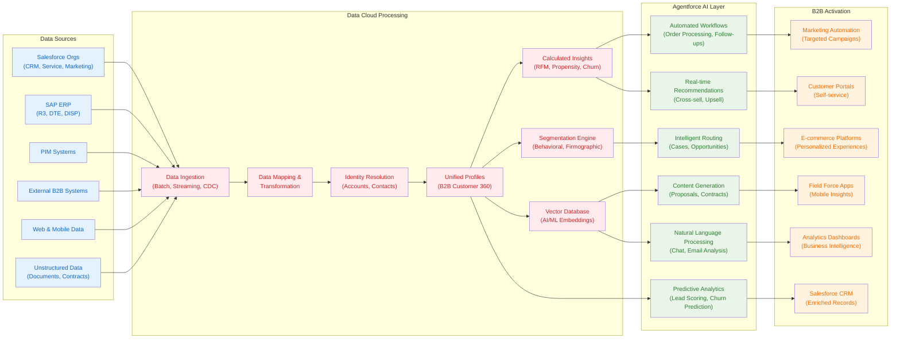
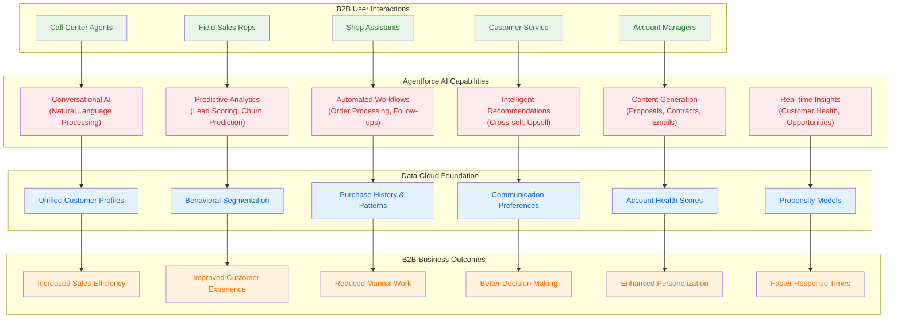

# B2B Future State Architecture: Salesforce Data Cloud & Agentforce Integration

## 📋 **Executive Summary**

This document outlines a comprehensive future state architecture for B2B operations, leveraging Salesforce Data Cloud and Agentforce to transform indirect retail capabilities. The architecture addresses the complex needs of B2B customer lifecycle management, commerce & fulfillment, workforce management, and data analytics through AI-powered automation and unified data management.

---

## 🎯 **Business Capabilities Analysis**

### **Current B2B Capabilities (From Customer Architecture)**

Based on the customer's existing architecture, the following B2B capabilities are identified:

#### **1. Customer Lifecycle Management**
- Account and Contact Management
- Territory and Audience Management  
- Segmentation
- Program and Service Enrollment
- Customer Advocacy

#### **2. Commerce & Fulfillment**
- Customer Order Management
- Return Order Management
- Customer Payment/Financial Management
- Catalogue Management
- Logistic and Route Management
- Price Management
- T/P POSM Management (Trade Promotion / Point of Sale Material)

#### **3. Customer Content & Communication**
- Media & Campaign Planning
- Direct Communication
- Content Management
- Media Purchases
- Retailer Education
- Knowledge Management for Retailers

#### **4. Workforce Management**
- Workforce Training Management
- Performance Management
- Time & Capacity Management
- Communication Management
- Knowledge Management for Workforce

#### **5. Data & Analytics**
- Customer Dashboard
- Reporting & Analytics
- Operational Reporting

#### **6. Customer Incentive Management**
- Compliance & Auditing
- Contract Management & Objective Setting
- Retailer Remuneration & Loyalty

#### **7. Activity Management**
- Orchestration
- Activity Planning
- Interaction Execution

---

## 🏗️ **Future State Architecture Overview**

### **High-Level B2B Architecture with Data Cloud & Agentforce**

```mermaid
graph TB
    subgraph "B2B User Personas"
        A1["Call Center Users"]
        A2["Shop Assistants"]
        A3["Shop Owners"]
        A4["Field Forces"]
        A5["Content Editors"]
        A6["Content Approvers"]
        A7["Digital Hubs"]
    end

    subgraph "B2B Touchpoints"
        B1["Tablet"]
        B2["Mobile"]
        B3["Desktop"]
        B4["Salesforce Mobile App"]
        B5["Offline: AXSY"]
        B6["Video Calls: TwilioVideo"]
        B7["Push Notifications"]
        B8["Survey: Qualtrics"]
    end

    subgraph "Salesforce Data Cloud & Agentforce Layer"
        C1["Data Cloud: Unified Customer Profiles"]
        C2["Data Cloud: Identity Resolution"]
        C3["Data Cloud: Segmentation Engine"]
        C4["Agentforce: AI-Powered Agents"]
        C5["Agentforce: Predictive Analytics"]
        C6["Agentforce: Automated Workflows"]
    end

    subgraph "Core B2B Business Capabilities"
        D1["Customer Lifecycle Management"]
        D2["Commerce & Fulfillment"]
        D3["Customer Content & Communication"]
        D4["Workforce Management"]
        D5["Data & Analytics"]
        D6["Customer Incentive Management"]
        D7["Activity Management"]
    end

    subgraph "Integration & Data Sources"
        E1["Salesforce Orgs (APAC, EMEA, Americas)"]
        E2["SAP ERP (R3, DTE, DISP)"]
        E3["PIM Systems"]
        E4["External B2B Systems"]
        E5["Marketing Platforms"]
        E6["Analytics Platforms"]
    end

    A1 --> B1
    A2 --> B2
    A3 --> B3
    A4 --> B4
    A5 --> B5
    A6 --> B6
    A7 --> B7

    B1 --> C1
    B2 --> C2
    B3 --> C3
    B4 --> C4
    B5 --> C5
    B6 --> C6

    C1 --> D1
    C2 --> D2
    C3 --> D3
    C4 --> D4
    C5 --> D5
    C6 --> D6

    E1 --> C1
    E2 --> C2
    E3 --> C3
    E4 --> C4
    E5 --> C5
    E6 --> C6

    style A1 fill:#e8f5e8,color:#2e7d32
    style A2 fill:#e8f5e8,color:#2e7d32
    style A3 fill:#e8f5e8,color:#2e7d32
    style A4 fill:#e8f5e8,color:#2e7d32
    style A5 fill:#e8f5e8,color:#2e7d32
    style A6 fill:#e8f5e8,color:#2e7d32
    style A7 fill:#e8f5e8,color:#2e7d32
    style B1 fill:#e3f2fd,color:#1565c0
    style B2 fill:#e3f2fd,color:#1565c0
    style B3 fill:#e3f2fd,color:#1565c0
    style B4 fill:#e3f2fd,color:#1565c0
    style B5 fill:#e3f2fd,color:#1565c0
    style B6 fill:#e3f2fd,color:#1565c0
    style B7 fill:#e3f2fd,color:#1565c0
    style B8 fill:#e3f2fd,color:#1565c0
    style C1 fill:#ffebee,color:#c62828
    style C2 fill:#ffebee,color:#c62828
    style C3 fill:#ffebee,color:#c62828
    style C4 fill:#ffebee,color:#c62828
    style C5 fill:#ffebee,color:#c62828
    style C6 fill:#ffebee,color:#c62828
    style D1 fill:#fff3e0,color:#ef6c00
    style D2 fill:#fff3e0,color:#ef6c00
    style D3 fill:#fff3e0,color:#ef6c00
    style D4 fill:#fff3e0,color:#ef6c00
    style D5 fill:#fff3e0,color:#ef6c00
    style D6 fill:#fff3e0,color:#ef6c00
    style D7 fill:#fff3e0,color:#ef6c00
    style E1 fill:#f3e5f5,color:#7b1fa2
    style E2 fill:#f3e5f5,color:#7b1fa2
    style E3 fill:#f3e5f5,color:#7b1fa2
    style E4 fill:#f3e5f5,color:#7b1fa2
    style E5 fill:#f3e5f5,color:#7b1fa2
    style E6 fill:#f3e5f5,color:#7b1fa2
```

---

## 🔄 **Data Flow Architecture**

### **B2B Data Integration & Processing Flow**

---

## 🤖 **Agentforce Integration Architecture**

### **AI-Powered B2B Agent Ecosystem**

---

## 🎯 **Why Data Cloud & Agentforce for B2B?**

### **1. Data Cloud: The Foundation for B2B Success**

#### **🔗 Unified Customer Identity**
- **Challenge**: B2B customers often have multiple touchpoints, contacts, and interactions across different systems
- **Solution**: Data Cloud provides unified identity resolution, creating a single source of truth for each B2B account
- **Benefit**: 360-degree view of customer relationships, enabling personalized experiences and better decision-making

#### **📊 Advanced Segmentation & Targeting**
- **Challenge**: B2B customers have complex buying behaviors, multiple decision-makers, and varying needs
- **Solution**: Data Cloud's segmentation engine creates sophisticated behavioral and firmographic segments
- **Benefit**: Targeted marketing campaigns, personalized sales approaches, and optimized customer journeys

#### **🔄 Real-time Data Processing**
- **Challenge**: B2B operations require real-time insights for immediate decision-making
- **Solution**: Data Cloud processes data in real-time, providing instant updates across all systems
- **Benefit**: Faster response times, improved customer service, and better operational efficiency

#### **📈 Predictive Analytics**
- **Challenge**: B2B sales cycles are long and complex, making it difficult to predict outcomes
- **Solution**: Data Cloud's ML capabilities provide predictive insights for lead scoring, churn prediction, and opportunity forecasting
- **Benefit**: Higher conversion rates, reduced churn, and improved sales forecasting

### **2. Agentforce: AI-Powered B2B Automation**

#### **🤖 Intelligent Automation**
- **Challenge**: B2B processes are often manual, time-consuming, and prone to errors
- **Solution**: Agentforce automates routine tasks like order processing, follow-ups, and data entry
- **Benefit**: Reduced manual work, improved accuracy, and increased productivity

#### **💬 Conversational AI**
- **Challenge**: B2B customers expect immediate, intelligent responses to their queries
- **Solution**: Agentforce provides natural language processing for chat, email, and voice interactions
- **Benefit**: 24/7 customer support, faster query resolution, and improved customer satisfaction

#### **🎯 Personalized Recommendations**
- **Challenge**: B2B customers have unique needs and preferences that change over time
- **Solution**: Agentforce analyzes customer data to provide personalized product and service recommendations
- **Benefit**: Increased cross-sell and upsell opportunities, higher customer lifetime value

#### **📋 Intelligent Workflow Management**
- **Challenge**: B2B processes involve multiple stakeholders and complex approval workflows
- **Solution**: Agentforce manages complex workflows, routing tasks to the right people at the right time
- **Benefit**: Streamlined processes, reduced bottlenecks, and improved collaboration

---

## 🚀 **Implementation Roadmap**

### **Phase 1: Foundation (Months 1-3)**
- **Data Cloud Setup**: Configure data ingestion from existing systems
- **Identity Resolution**: Implement unified customer profiles
- **Basic Segmentation**: Create initial customer segments
- **Agentforce Pilot**: Deploy AI agents for basic customer service

### **Phase 2: Enhancement (Months 4-6)**
- **Advanced Analytics**: Implement predictive models and insights
- **Workflow Automation**: Automate key B2B processes
- **Personalization**: Deploy personalized experiences across touchpoints
- **Integration**: Connect with external B2B systems

### **Phase 3: Optimization (Months 7-12)**
- **AI Enhancement**: Deploy advanced AI capabilities
- **Performance Optimization**: Fine-tune models and workflows
- **Scale**: Expand to all B2B channels and processes
- **Innovation**: Implement cutting-edge AI features

---

## 📊 **Expected Business Outcomes**

### **Quantitative Benefits**
- **25-40%** increase in sales efficiency
- **30-50%** reduction in manual work
- **20-35%** improvement in customer satisfaction
- **15-30%** increase in cross-sell/upsell revenue
- **40-60%** faster response times

### **Qualitative Benefits**
- **Enhanced Customer Experience**: Personalized, intelligent interactions
- **Improved Employee Productivity**: AI-powered assistance and automation
- **Better Decision Making**: Data-driven insights and recommendations
- **Increased Agility**: Real-time data processing and automated workflows
- **Competitive Advantage**: Advanced AI capabilities and unified data management

---

## 🔧 **Technical Architecture Components**

### **Data Cloud Components**
- **Data Ingestion**: Batch, streaming, and CDC data processing
- **Identity Resolution**: Advanced matching algorithms for B2B entities
- **Unified Profiles**: Comprehensive customer 360 views
- **Segmentation Engine**: Behavioral and firmographic segmentation
- **ML Platform**: Predictive analytics and insights generation
- **Activation**: Real-time data distribution to operational systems

### **Agentforce Components**
- **Conversational AI**: Natural language processing and generation
- **Predictive Analytics**: Lead scoring, churn prediction, and forecasting
- **Workflow Automation**: Intelligent process management
- **Content Generation**: Automated proposal and contract creation
- **Recommendation Engine**: Personalized product and service suggestions
- **Integration Layer**: Seamless connection with existing systems

---

## 🎯 **Conclusion**

The integration of Salesforce Data Cloud and Agentforce provides a comprehensive solution for B2B operations, addressing the complex needs of indirect retail capabilities. By unifying data, automating processes, and providing AI-powered insights, this architecture enables organizations to:

1. **Deliver exceptional customer experiences** through personalized, intelligent interactions
2. **Increase operational efficiency** through automation and AI assistance
3. **Make data-driven decisions** with real-time insights and predictive analytics
4. **Scale B2B operations** across multiple channels and touchpoints
5. **Maintain competitive advantage** through advanced AI capabilities

This future state architecture positions organizations for success in the evolving B2B landscape, where customer expectations are high, competition is fierce, and data-driven insights are essential for growth.

---

*This document serves as a strategic blueprint for implementing Salesforce Data Cloud and Agentforce in B2B environments, providing a clear path to digital transformation and competitive advantage.*
