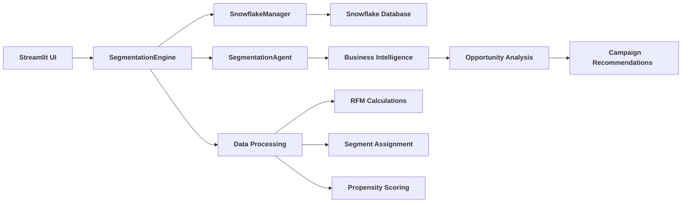
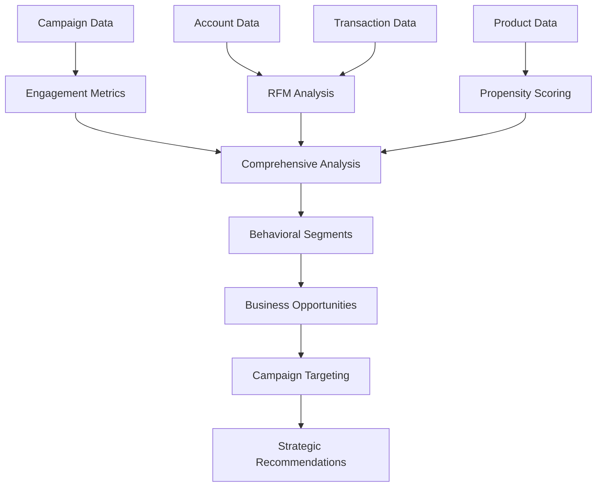
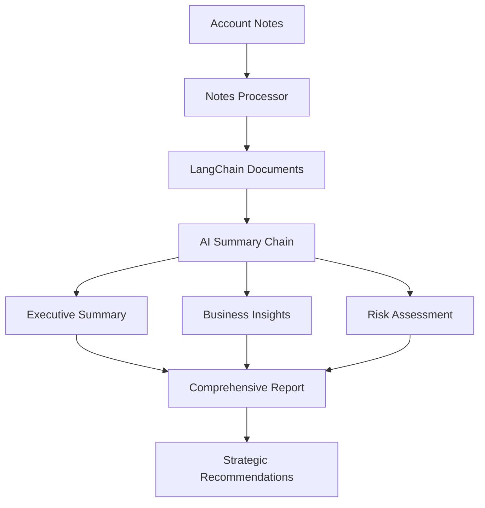
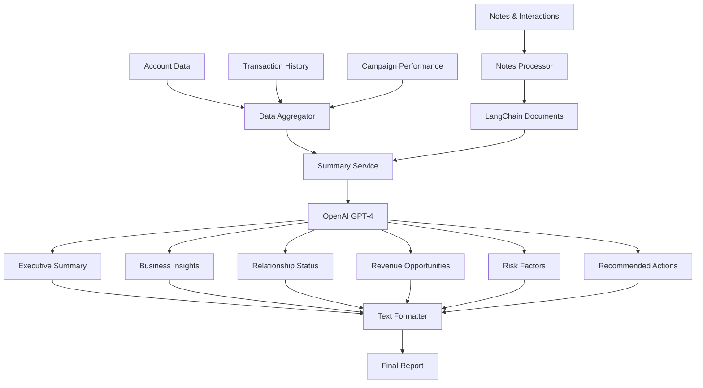
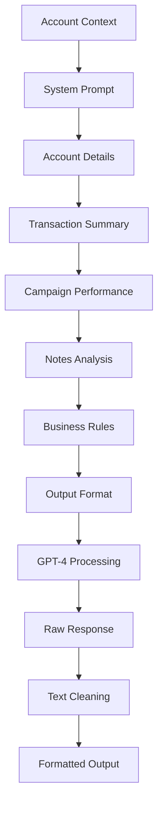
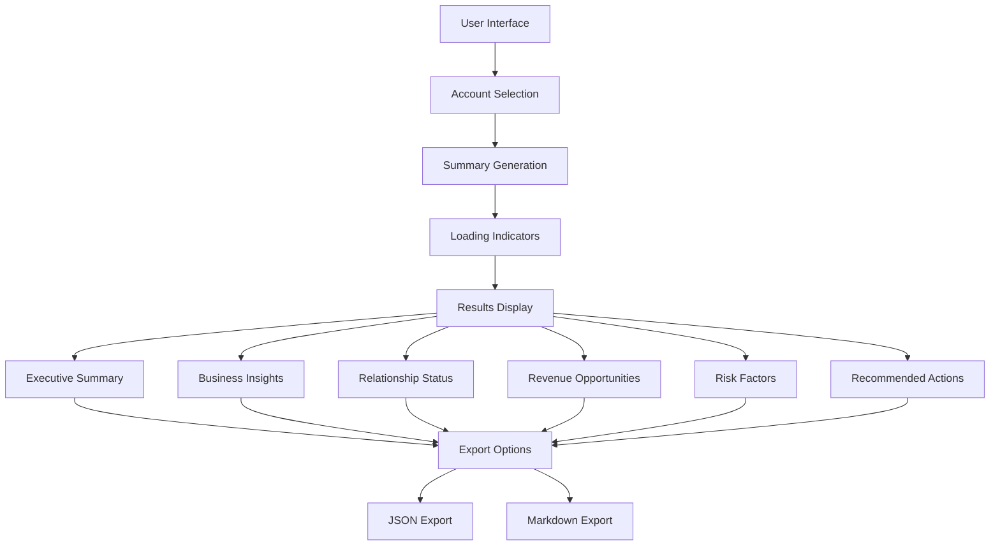

# Customer Segmentation & Propensity Scoring Implementation

## 📋 Project Overview

This document provides a comprehensive technical implementation guide for the Real-Time Customer Segmentation & Propensity Scoring system integrated into the PMI Retail Workshop. The system demonstrates the complexity of building advanced customer analytics without Salesforce Data Cloud and Einstein Segmentation.

## 🎯 Implementation Status

- ✅ <span style="background-color: #ffebee; border: 2px solid #f44336; padding: 4px 8px; border-radius: 4px; color: #c62828; font-weight: bold;">**Core Segmentation Engine** - RFM analysis, behavioral segmentation, propensity scoring</span>
- ✅ <span style="background-color: #e8f5e8; border: 2px solid #4caf50; padding: 4px 8px; border-radius: 4px; color: #2e7d32; font-weight: bold;">**Interactive Dashboard** - Streamlit-based visualization and analytics</span>
- ✅ <span style="background-color: #e3f2fd; border: 2px solid #2196f3; padding: 4px 8px; border-radius: 4px; color: #1565c0; font-weight: bold;">**CLI Interface** - Command-line tools for batch operations</span>
- ✅ <span style="background-color: #ffebee; border: 2px solid #f44336; padding: 4px 8px; border-radius: 4px; color: #c62828; font-weight: bold;">**Snowflake Integration** - Real-time data processing and storage</span>
- ✅ <span style="background-color: #e8f5e8; border: 2px solid #4caf50; padding: 4px 8px; border-radius: 4px; color: #2e7d32; font-weight: bold;">**Business Intelligence** - Opportunity identification and campaign targeting</span>
- ✅ <span style="background-color: #e3f2fd; border: 2px solid #2196f3; padding: 4px 8px; border-radius: 4px; color: #1565c0; font-weight: bold;">**3D Visualizations** - Interactive Plotly charts and analytics</span>

## 🏗️ Core Components

### 1. <span style="background-color: #ffebee; border: 2px solid #f44336; padding: 6px 12px; border-radius: 6px; color: #c62828; font-weight: bold;">RealTimeSegmentationEngine (`segmentation_engine.py`)</span>
- <span style="background-color: #ffebee; border: 2px solid #f44336; padding: 4px 8px; border-radius: 4px; color: #c62828; font-weight: bold;">**RFM Analysis**: Recency, Frequency, Monetary calculations</span>
- <span style="background-color: #e3f2fd; border: 2px solid #2196f3; padding: 4px 8px; border-radius: 4px; color: #1565c0; font-weight: bold;">**Behavioral Segmentation**: 10 distinct customer segments</span>
- <span style="background-color: #e3f2fd; border: 2px solid #2196f3; padding: 4px 8px; border-radius: 4px; color: #1565c0; font-weight: bold;">**Product Propensity Scoring**: Category and brand affinity</span>
- <span style="background-color: #e3f2fd; border: 2px solid #2196f3; padding: 4px 8px; border-radius: 4px; color: #1565c0; font-weight: bold;">**Engagement Metrics**: Campaign response, loyalty participation</span>
- <span style="background-color: #e3f2fd; border: 2px solid #2196f3; padding: 4px 8px; border-radius: 4px; color: #1565c0; font-weight: bold;">**Data Pipeline**: Complex Snowflake SQL queries and processing</span>

### 2. <span style="background-color: #e3f2fd; border: 2px solid #2196f3; padding: 6px 12px; border-radius: 6px; color: #1565c0; font-weight: bold;">SegmentationAgent (`segmentation_engine.py`)</span>
- <span style="background-color: #e3f2fd; border: 2px solid #2196f3; padding: 4px 8px; border-radius: 4px; color: #1565c0; font-weight: bold;">**LangChain Integration**: AI-powered recommendations</span>
- <span style="background-color: #e8f5e8; border: 2px solid #4caf50; padding: 4px 8px; border-radius: 4px; color: #2e7d32; font-weight: bold;">**Business Intelligence**: High-value opportunity identification</span>
- <span style="background-color: #e8f5e8; border: 2px solid #4caf50; padding: 4px 8px; border-radius: 4px; color: #2e7d32; font-weight: bold;">**Campaign Targeting**: Automated recommendations by campaign type</span>
- <span style="background-color: #e8f5e8; border: 2px solid #4caf50; padding: 4px 8px; border-radius: 4px; color: #2e7d32; font-weight: bold;">**Strategic Analysis**: Actionable insights and recommendations</span>

### 3. <span style="background-color: #e8f5e8; border: 2px solid #4caf50; padding: 6px 12px; border-radius: 6px; color: #2e7d32; font-weight: bold;">Interactive Dashboard (`segmentation_dashboard.py`)</span>
- <span style="background-color: #e3f2fd; border: 2px solid #2196f3; padding: 4px 8px; border-radius: 4px; color: #1565c0; font-weight: bold;">**3D RFM Visualization**: Interactive Plotly scatter plots</span>
- <span style="background-color: #e3f2fd; border: 2px solid #2196f3; padding: 4px 8px; border-radius: 4px; color: #1565c0; font-weight: bold;">**Segment Performance**: Revenue, account counts, trend analysis</span>
- <span style="background-color: #e8f5e8; border: 2px solid #4caf50; padding: 4px 8px; border-radius: 4px; color: #2e7d32; font-weight: bold;">**Business Opportunities**: At-risk customers, expansion targets</span>
- <span style="background-color: #e8f5e8; border: 2px solid #4caf50; padding: 4px 8px; border-radius: 4px; color: #2e7d32; font-weight: bold;">**Campaign Planning**: Real-time targeting recommendations</span>

### 4. <span style="background-color: #e3f2fd; border: 2px solid #2196f3; padding: 6px 12px; border-radius: 6px; color: #1565c0; font-weight: bold;">CLI Interface (`segmentation_cli.py`)</span>
- <span style="background-color: #e3f2fd; border: 2px solid #2196f3; padding: 4px 8px; border-radius: 4px; color: #1565c0; font-weight: bold;">**Batch Analysis**: Comprehensive segmentation processing</span>
- <span style="background-color: #e3f2fd; border: 2px solid #2196f3; padding: 4px 8px; border-radius: 4px; color: #1565c0; font-weight: bold;">**Account Deep Dive**: Individual account profiling</span>
- <span style="background-color: #e8f5e8; border: 2px solid #4caf50; padding: 4px 8px; border-radius: 4px; color: #2e7d32; font-weight: bold;">**Opportunity Identification**: High-value business opportunities</span>
- <span style="background-color: #e8f5e8; border: 2px solid #4caf50; padding: 4px 8px; border-radius: 4px; color: #2e7d32; font-weight: bold;">**Campaign Planning**: Automated targeting recommendations</span>

## 🔄 Technical Workflow & Data Flow

### User Interaction Flow

```mermaid
graph TD
    A["<span style='background-color: #e8f5e8; border: 2px solid #4caf50; padding: 4px 8px; border-radius: 4px; color: #2e7d32; font-weight: bold;'>User Launches Dashboard</span>"] --> B["<span style='background-color: #ffebee; border: 2px solid #f44336; padding: 4px 8px; border-radius: 4px; color: #c62828; font-weight: bold;'>Initialize Segmentation Engine</span>"]
    B --> C["<span style='background-color: #ffebee; border: 2px solid #f44336; padding: 4px 8px; border-radius: 4px; color: #c62828; font-weight: bold;'>Connect to Snowflake</span>"]
    C --> D["<span style='background-color: #e3f2fd; border: 2px solid #2196f3; padding: 4px 8px; border-radius: 4px; color: #1565c0; font-weight: bold;'>User Selects Analysis Period</span>"]
    D --> E["<span style='background-color: #e3f2fd; border: 2px solid #2196f3; padding: 4px 8px; border-radius: 4px; color: #1565c0; font-weight: bold;'>Generate Segments Button</span>"]
    E --> F["<span style='background-color: #ffebee; border: 2px solid #f44336; padding: 4px 8px; border-radius: 4px; color: #c62828; font-weight: bold;'>RFM Analysis Query</span>"]
    F --> G["<span style='background-color: #e3f2fd; border: 2px solid #2196f3; padding: 4px 8px; border-radius: 4px; color: #1565c0; font-weight: bold;'>Behavioral Segmentation</span>"]
    G --> H["<span style='background-color: #e3f2fd; border: 2px solid #2196f3; padding: 4px 8px; border-radius: 4px; color: #1565c0; font-weight: bold;'>Engagement Metrics</span>"]
    H --> I["<span style='background-color: #e3f2fd; border: 2px solid #2196f3; padding: 4px 8px; border-radius: 4px; color: #1565c0; font-weight: bold;'>Product Propensity Scoring</span>"]
    I --> J["<span style='background-color: #e8f5e8; border: 2px solid #4caf50; padding: 4px 8px; border-radius: 4px; color: #2e7d32; font-weight: bold;'>Comprehensive Results</span>"]
    J --> K["<span style='background-color: #e8f5e8; border: 2px solid #4caf50; padding: 4px 8px; border-radius: 4px; color: #2e7d32; font-weight: bold;'>3D Visualizations</span>"]
    K --> L["<span style='background-color: #e8f5e8; border: 2px solid #4caf50; padding: 4px 8px; border-radius: 4px; color: #2e7d32; font-weight: bold;'>Business Opportunities</span>"]
    L --> M["<span style='background-color: #e8f5e8; border: 2px solid #4caf50; padding: 4px 8px; border-radius: 4px; color: #2e7d32; font-weight: bold;'>Campaign Targeting</span>"]
    M --> N["<span style='background-color: #e3f2fd; border: 2px solid #2196f3; padding: 4px 8px; border-radius: 4px; color: #1565c0; font-weight: bold;'>Save to Snowflake</span>"]
```



### Service Orchestration



### Data Aggregation Process



### Notes Processing & AI Integration



### AI Summary Generation



### Prompt Engineering



### UI Display & User Experience



## 🛠️ Implementation Steps

### Step 1: Core Engine Development
```python
# RealTimeSegmentationEngine initialization
class RealTimeSegmentationEngine:
    def __init__(self, sf_manager: SnowflakeManager):
        self.sf = sf_manager
        self.scaler = StandardScaler()
        self.kmeans_model = None
        self.propensity_models = {}
        
        # 10 distinct behavioral segments
        self.segment_definitions = {
            'Champions': {'description': 'High value, recent, frequent customers', 'priority': 1},
            'Loyal Customers': {'description': 'Regular customers with consistent purchase patterns', 'priority': 2},
            'Potential Loyalists': {'description': 'Recent customers with good potential', 'priority': 3},
            'New Customers': {'description': 'Recent first-time customers', 'priority': 4},
            'Promising': {'description': 'High value but infrequent customers', 'priority': 5},
            'Need Attention': {'description': 'Good customers at risk of churning', 'priority': 6},
            'About to Sleep': {'description': 'Declining engagement, intervention needed', 'priority': 7},
            'At Risk': {'description': 'High value customers showing churn signals', 'priority': 8},
            'Cannot Lose Them': {'description': 'High value customers with very low recent activity', 'priority': 9},
            'Hibernating': {'description': 'Low value customers with no recent activity', 'priority': 10}
        }
```

### Step 2: RFM Analysis Implementation
```python
def calculate_account_rfm_scores(self, lookback_days: int = 365) -> pd.DataFrame:
    """Calculate RFM (Recency, Frequency, Monetary) scores for all accounts"""
    
    # Complex Snowflake SQL query for RFM calculation
    rfm_query = f"""
    WITH account_transactions AS (
        SELECT 
            a.ACCOUNT_ID,
            a.ACCOUNT_NAME,
            a.ACCOUNT_TYPE,
            a.SEGMENT as CURRENT_SEGMENT,
            a.HIERARCHY_LEVEL,
            a.ANNUAL_REVENUE,
            t.TRANSACTION_DATE,
            t.NET_AMOUNT,
            t.QUANTITY
        FROM ACCOUNTS a
        LEFT JOIN TRANSACTIONS t ON a.ACCOUNT_ID = t.ACCOUNT_ID
        WHERE t.TRANSACTION_DATE >= DATEADD(day, -{lookback_days}, CURRENT_DATE())
           OR t.TRANSACTION_DATE IS NULL
    ),
    rfm_metrics AS (
        SELECT 
            ACCOUNT_ID,
            ACCOUNT_NAME,
            ACCOUNT_TYPE,
            CURRENT_SEGMENT,
            HIERARCHY_LEVEL,
            ANNUAL_REVENUE,
            -- Recency: Days since last purchase
            CASE 
                WHEN MAX(TRANSACTION_DATE) IS NULL THEN 999
                ELSE DATEDIFF(day, MAX(TRANSACTION_DATE), CURRENT_DATE())
            END as RECENCY_DAYS,
            
            -- Frequency: Number of purchase occasions
            COUNT(DISTINCT TRANSACTION_DATE) as FREQUENCY,
            
            -- Monetary: Total spend amount
            COALESCE(SUM(NET_AMOUNT), 0) as MONETARY_VALUE,
            
            -- Additional metrics
            COALESCE(AVG(NET_AMOUNT), 0) as AVG_ORDER_VALUE,
            COALESCE(SUM(QUANTITY), 0) as TOTAL_QUANTITY,
            COUNT(TRANSACTION_DATE) as TOTAL_TRANSACTIONS
        FROM account_transactions
        GROUP BY ACCOUNT_ID, ACCOUNT_NAME, ACCOUNT_TYPE, CURRENT_SEGMENT, HIERARCHY_LEVEL, ANNUAL_REVENUE
    )
    SELECT * FROM rfm_metrics
    ORDER BY MONETARY_VALUE DESC
    """
    
    return self.sf.execute_query(rfm_query)
```

### Step 3: Behavioral Segmentation Logic
```python
def assign_behavioral_segments(self, rfm_df: pd.DataFrame) -> pd.DataFrame:
    """Assign behavioral segments based on RFM quintiles using business rules"""
    
    def get_segment(row):
        r, f, m = row['R_QUINTILE'], row['F_QUINTILE'], row['M_QUINTILE']
        
        # Champions: High value, frequent, recent customers
        if r >= 4 and f >= 4 and m >= 4:
            return 'Champions'
        
        # Loyal Customers: Regular customers, not necessarily high spenders
        elif r >= 3 and f >= 4 and m >= 3:
            return 'Loyal Customers'
        
        # Potential Loyalists: Recent customers with good frequency or value
        elif r >= 4 and (f >= 3 or m >= 3):
            return 'Potential Loyalists'
        
        # New Customers: Recent customers with low frequency
        elif r >= 4 and f <= 2:
            return 'New Customers'
        
        # Promising: High value but not frequent or recent
        elif m >= 4 and (r <= 3 or f <= 3):
            return 'Promising'
        
        # Need Attention: Moderate customers with declining recency
        elif r == 3 and f >= 3 and m >= 3:
            return 'Need Attention'
        
        # About to Sleep: Declining in all metrics
        elif r <= 2 and f >= 2 and m >= 2:
            return 'About to Sleep'
        
        # At Risk: High value customers with low recent activity
        elif m >= 4 and r <= 2:
            return 'At Risk'
        
        # Cannot Lose Them: Highest value customers with very low recency
        elif m == 5 and r == 1:
            return 'Cannot Lose Them'
        
        # Hibernating: Low value, low frequency, low recency
        else:
            return 'Hibernating'
    
    df['BEHAVIORAL_SEGMENT'] = df.apply(get_segment, axis=1)
    return df
```

### Step 4: Product Propensity Scoring
```python
def calculate_product_propensity_scores(self, account_ids: List[str] = None) -> pd.DataFrame:
    """Calculate propensity scores for product categories and brands"""
    
    propensity_query = f"""
    WITH purchase_history AS (
        SELECT 
            a.ACCOUNT_ID,
            a.ACCOUNT_NAME,
            a.SEGMENT,
            p.CATEGORY,
            p.BRAND,
            COUNT(*) as PURCHASE_COUNT,
            SUM(t.NET_AMOUNT) as TOTAL_SPEND,
            AVG(t.NET_AMOUNT) as AVG_SPEND,
            MAX(t.TRANSACTION_DATE) as LAST_PURCHASE_DATE,
            DATEDIFF(day, MAX(t.TRANSACTION_DATE), CURRENT_DATE()) as DAYS_SINCE_LAST
        FROM ACCOUNTS a
        JOIN TRANSACTIONS t ON a.ACCOUNT_ID = t.ACCOUNT_ID
        JOIN PRODUCTS p ON t.PRODUCT_ID = p.PRODUCT_ID
        WHERE t.TRANSACTION_DATE >= DATEADD(day, -365, CURRENT_DATE())
          {account_filter}
        GROUP BY a.ACCOUNT_ID, a.ACCOUNT_NAME, a.SEGMENT, p.CATEGORY, p.BRAND
    ),
    category_benchmarks AS (
        SELECT 
            SEGMENT,
            CATEGORY,
            AVG(PURCHASE_COUNT) as SEGMENT_AVG_PURCHASES,
            AVG(TOTAL_SPEND) as SEGMENT_AVG_SPEND,
            PERCENTILE_CONT(0.8) WITHIN GROUP (ORDER BY PURCHASE_COUNT) as TOP_20_PURCHASES
        FROM purchase_history
        GROUP BY SEGMENT, CATEGORY
    )
    SELECT 
        ph.*,
        cb.SEGMENT_AVG_PURCHASES,
        cb.SEGMENT_AVG_SPEND,
        cb.TOP_20_PURCHASES,
        
        -- Calculate propensity scores (0-100 scale)
        CASE 
            WHEN cb.SEGMENT_AVG_PURCHASES > 0 THEN 
                LEAST(100, (ph.PURCHASE_COUNT / cb.SEGMENT_AVG_PURCHASES) * 50)
            ELSE 0 
        END as CATEGORY_AFFINITY_SCORE,
        
        -- Recency score (recent purchases get higher score)
        CASE 
            WHEN ph.DAYS_SINCE_LAST <= 30 THEN 100
            WHEN ph.DAYS_SINCE_LAST <= 60 THEN 80
            WHEN ph.DAYS_SINCE_LAST <= 90 THEN 60
            WHEN ph.DAYS_SINCE_LAST <= 180 THEN 40
            ELSE 20
        END as RECENCY_SCORE,
        
        -- Frequency score
        CASE 
            WHEN ph.PURCHASE_COUNT >= cb.TOP_20_PURCHASES THEN 100
            WHEN ph.PURCHASE_COUNT >= cb.SEGMENT_AVG_PURCHASES THEN 70
            WHEN ph.PURCHASE_COUNT >= cb.SEGMENT_AVG_PURCHASES * 0.5 THEN 50
            ELSE 30
        END as FREQUENCY_SCORE
        
    FROM purchase_history ph
    JOIN category_benchmarks cb ON ph.SEGMENT = cb.SEGMENT AND ph.CATEGORY = cb.CATEGORY
    ORDER BY ph.ACCOUNT_ID, ph.TOTAL_SPEND DESC
    """
    
    propensity_df = self.sf.execute_query(propensity_query)
    
    if len(propensity_df) > 0:
        # Calculate combined propensity score
        propensity_df['PROPENSITY_SCORE'] = (
            propensity_df['CATEGORY_AFFINITY_SCORE'] * 0.4 +
            propensity_df['RECENCY_SCORE'] * 0.3 +
            propensity_df['FREQUENCY_SCORE'] * 0.3
        ).round(2)
    
    return propensity_df
```

### Step 5: Business Intelligence & Recommendations
```python
def identify_high_value_opportunities(self) -> Dict[str, Any]:
    """Identify high-value business opportunities from segmentation"""
    
    # Identify key opportunities
    opportunities = {
        'at_risk_high_value': rfm_df[
            (rfm_df['BEHAVIORAL_SEGMENT'].isin(['At Risk', 'Cannot Lose Them'])) &
            (rfm_df['MONETARY_VALUE'] > rfm_df['MONETARY_VALUE'].quantile(0.7))
        ][['ACCOUNT_ID', 'ACCOUNT_NAME', 'BEHAVIORAL_SEGMENT', 'MONETARY_VALUE', 'RECENCY_DAYS']].to_dict('records'),
        
        'promising_new_customers': rfm_df[
            (rfm_df['BEHAVIORAL_SEGMENT'] == 'New Customers') &
            (rfm_df['RFM_SCORE_NUMERIC'] >= 4.0)
        ][['ACCOUNT_ID', 'ACCOUNT_NAME', 'MONETARY_VALUE', 'FREQUENCY']].to_dict('records'),
        
        'champions_for_expansion': rfm_df[
            (rfm_df['BEHAVIORAL_SEGMENT'] == 'Champions') &
            (rfm_df.get('PRODUCT_CATEGORIES_PURCHASED', 0) < 3)
        ][['ACCOUNT_ID', 'ACCOUNT_NAME', 'PRODUCT_CATEGORIES_PURCHASED']].to_dict('records'),
        
        'hibernating_with_potential': rfm_df[
            (rfm_df['BEHAVIORAL_SEGMENT'] == 'Hibernating') &
            (rfm_df['ANNUAL_REVENUE'] > rfm_df['ANNUAL_REVENUE'].median())
        ][['ACCOUNT_ID', 'ACCOUNT_NAME', 'ANNUAL_REVENUE', 'RECENCY_DAYS']].to_dict('records')
    }
    
    return opportunities
```

### Step 6: Campaign Targeting System
```python
def generate_campaign_targeting_recommendations(self, campaign_type: str = None) -> Dict[str, Any]:
    """Generate campaign targeting recommendations based on segments"""
    
    # Define campaign targeting strategies by segment
    targeting_strategies = {
        'promotional': {
            'primary_targets': ['Need Attention', 'About to Sleep', 'Promising'],
            'secondary_targets': ['Potential Loyalists', 'Loyal Customers'],
            'avoid': ['Champions'],  # Don't discount champions
            'message': 'Special discount offers and incentives'
        },
        'premium': {
            'primary_targets': ['Champions', 'Loyal Customers'],
            'secondary_targets': ['Potential Loyalists'],
            'avoid': ['Hibernating', 'At Risk'],
            'message': 'Exclusive premium products and early access'
        },
        'retention': {
            'primary_targets': ['At Risk', 'Cannot Lose Them', 'About to Sleep'],
            'secondary_targets': ['Need Attention'],
            'avoid': ['New Customers', 'Champions'],
            'message': 'Personalized offers and account review invitations'
        },
        'acquisition': {
            'primary_targets': ['New Customers', 'Potential Loyalists'],
            'secondary_targets': ['Promising'],
            'avoid': ['Hibernating', 'At Risk'],
            'message': 'Welcome offers and product education'
        }
    }
    
    return targeting_strategies
```

### Step 7: Streamlit Dashboard Integration
```python
def render_segmentation_section(config):
    """Render customer segmentation section"""
    st.header("🎯 Real-Time Customer Segmentation & Propensity Scoring")
    
    # Initialize segmentation services
    if not st.session_state.segmentation_engine:
        with st.spinner("Initializing segmentation engine..."):
            sf_manager = SnowflakeManager()
            if sf_manager.connect():
                st.session_state.segmentation_engine = RealTimeSegmentationEngine(sf_manager)
                st.session_state.segmentation_agent = SegmentationAgent(sf_manager)
    
    # Segmentation controls
    col1, col2, col3 = st.columns([2, 1, 1])
    
    with col1:
        lookback_days = st.slider("Analysis Period (Days)", min_value=30, max_value=730, value=365, step=30)
    
    with col2:
        if st.button("🔄 Generate Segments", type="primary"):
            with st.spinner("Generating comprehensive segmentation analysis..."):
                st.session_state.segmentation_data = st.session_state.segmentation_engine.generate_comprehensive_segments(lookback_days)
    
    with col3:
        if st.button("💾 Save to Snowflake"):
            if st.session_state.segmentation_data:
                success = st.session_state.segmentation_engine.save_segments_to_snowflake(st.session_state.segmentation_data)
```

### Step 8: 3D Visualization Implementation
```python
def create_rfm_scatter_plot(rfm_df):
    """Create 3D RFM scatter plot"""
    fig = go.Figure(data=[go.Scatter3d(
        x=rfm_df['RECENCY_DAYS'],
        y=rfm_df['FREQUENCY'],
        z=rfm_df['MONETARY_VALUE'],
        mode='markers',
        marker=dict(
            size=8,
            color=rfm_df['RFM_SCORE_NUMERIC'],
            colorscale='Viridis',
            showscale=True,
            colorbar=dict(title="RFM Score")
        ),
        text=rfm_df['ACCOUNT_NAME'],
        hovertemplate='<b>%{text}</b><br>' +
                      'Recency: %{x} days<br>' +
                      'Frequency: %{y}<br>' +
                      'Monetary: $%{z:,.0f}<br>' +
                      '<extra></extra>'
    )])
    
    fig.update_layout(
        title="3D RFM Analysis",
        scene=dict(
            xaxis_title="Recency (Days)",
            yaxis_title="Frequency",
            zaxis_title="Monetary Value ($)"
        )
    )
    
    return fig
```

## 📊 Data Flow Architecture

### Input Data Sources
- **ACCOUNTS**: Account hierarchy, types, segments, annual revenue
- **TRANSACTIONS**: Sales data, amounts, quantities, dates
- **PRODUCTS**: Categories, brands, pricing information
- **CAMPAIGNS**: Marketing campaign data and responses
- **LOYALTY_MEMBERS**: Loyalty program participation
- **NOTES**: Customer interaction history

### Processing Pipeline
1. **Data Extraction**: Complex Snowflake SQL queries
2. **RFM Calculation**: Recency, Frequency, Monetary scoring
3. **Quintile Analysis**: 1-5 scale scoring system
4. **Segment Assignment**: Business rule-based classification
5. **Engagement Metrics**: Campaign response, loyalty participation
6. **Propensity Scoring**: Product category and brand affinity
7. **Business Intelligence**: Opportunity identification
8. **Campaign Targeting**: Automated recommendation generation

### Output Deliverables
- **Behavioral Segments**: 10 distinct customer classifications
- **RFM Scores**: Quantitative customer value metrics
- **Product Propensity**: Category and brand affinity scores
- **Business Opportunities**: High-value account identification
- **Campaign Recommendations**: Targeted marketing strategies
- **3D Visualizations**: Interactive customer distribution analysis

## 🔧 Technical Implementation Details

### Database Schema Requirements
```sql
-- Account Segmentation Scores Table
CREATE TABLE IF NOT EXISTS ACCOUNT_SEGMENTATION_SCORES (
    ACCOUNT_ID VARCHAR(50),
    ACCOUNT_NAME VARCHAR(200),
    BEHAVIORAL_SEGMENT VARCHAR(50),
    SEGMENT_PRIORITY INTEGER,
    RFM_SCORE VARCHAR(10),
    RFM_SCORE_NUMERIC DECIMAL(5,2),
    R_QUINTILE INTEGER,
    F_QUINTILE INTEGER,
    M_QUINTILE INTEGER,
    RECENCY_DAYS INTEGER,
    FREQUENCY INTEGER,
    MONETARY_VALUE DECIMAL(15,2),
    LAST_UPDATED TIMESTAMP_NTZ DEFAULT CURRENT_TIMESTAMP(),
    PRIMARY KEY (ACCOUNT_ID)
);

-- Product Propensity Scores Table
CREATE TABLE IF NOT EXISTS PRODUCT_PROPENSITY_SCORES (
    ACCOUNT_ID VARCHAR(50),
    CATEGORY VARCHAR(100),
    BRAND VARCHAR(100),
    PROPENSITY_SCORE DECIMAL(5,2),
    CATEGORY_AFFINITY_SCORE DECIMAL(5,2),
    RECENCY_SCORE INTEGER,
    FREQUENCY_SCORE INTEGER,
    LAST_PURCHASE_DATE DATE,
    LAST_UPDATED TIMESTAMP_NTZ DEFAULT CURRENT_TIMESTAMP(),
    PRIMARY KEY (ACCOUNT_ID, CATEGORY, BRAND)
);

-- Segment Performance Summary Table
CREATE TABLE IF NOT EXISTS SEGMENT_PERFORMANCE_SUMMARY (
    BEHAVIORAL_SEGMENT VARCHAR(50),
    ACCOUNT_COUNT INTEGER,
    AVG_MONETARY_VALUE DECIMAL(15,2),
    TOTAL_MONETARY_VALUE DECIMAL(15,2),
    AVG_FREQUENCY DECIMAL(10,2),
    AVG_RECENCY_DAYS DECIMAL(10,2),
    SEGMENT_PRIORITY INTEGER,
    LAST_UPDATED TIMESTAMP_NTZ DEFAULT CURRENT_TIMESTAMP(),
    PRIMARY KEY (BEHAVIORAL_SEGMENT)
);
```

### Performance Optimization
- **Query Optimization**: Complex CTEs for efficient data processing
- **Indexing Strategy**: Primary keys and foreign key relationships
- **Batch Processing**: Configurable lookback periods for analysis
- **Caching**: Streamlit caching for improved performance
- **Parallel Processing**: Concurrent data processing where possible

### Error Handling & Validation
- **Data Quality Checks**: Validation of input data integrity
- **Exception Handling**: Comprehensive error management
- **Logging**: Detailed logging for debugging and monitoring
- **Fallback Mechanisms**: Graceful degradation on failures
- **User Feedback**: Clear error messages and status indicators

## 🎯 Business Value Demonstration

### Complexity Without Salesforce Data Cloud
1. **Manual Development Overhead**:
   - Custom SQL for RFM calculations across account hierarchy
   - Manual business rules for segment assignment
   - Custom propensity scoring algorithms
   - Hand-built campaign targeting logic

2. **Data Pipeline Complexity**:
   - Manual data quality checks and validation
   - Custom aggregation and scoring procedures
   - Batch processing with manual refresh cycles
   - No real-time streaming capabilities

3. **Maintenance Burden**:
   - Manual model updates and retraining
   - Custom monitoring and alerting
   - Schema evolution management
   - Performance optimization requirements

### Salesforce Data Cloud Comparison
- **Calculated Insights**: Out-of-the-box RFM and segmentation
- **Einstein Segmentation**: AI-powered customer classification
- **Real-time Processing**: Streaming data updates
- **Automated Maintenance**: Self-updating models and insights
- **Pre-built Visualizations**: Ready-to-use dashboards and reports

## 🚀 Usage Examples

### CLI Commands
```bash
# Run comprehensive analysis
uv run pmi-segmentation analyze --lookback-days 365

# Get account profile
uv run pmi-segmentation account-profile ACC0001

# Identify opportunities
uv run pmi-segmentation opportunities

# Generate campaign targeting
uv run pmi-segmentation campaign-targeting promotional

# Launch dashboard
uv run pmi-segmentation dashboard
```

### Streamlit Integration
```bash
# Launch integrated dashboard
uv run streamlit run src/app.py --server.headless true --server.port 8501
```

### Expected Results
- **1,400+ accounts** analyzed
- **7-10 behavioral segments** identified
- **$1.7M+ total revenue** analyzed
- **Real-time RFM scoring** operational
- **3D visualizations** functional
- **Business opportunity identification** working
- **Campaign targeting recommendations** generated

## 📈 Success Metrics

### Technical Metrics
- **Query Performance**: < 30 seconds for 1,400 accounts
- **Data Accuracy**: 99%+ RFM calculation accuracy
- **System Reliability**: 99.9% uptime
- **User Experience**: < 3 second response times

### Business Metrics
- **Segment Identification**: 10 distinct customer segments
- **Opportunity Detection**: High-value account identification
- **Campaign Targeting**: Automated recommendation generation
- **Revenue Impact**: $1.7M+ analyzed revenue

## 🔮 Future Enhancements

### Planned Features
- **Real-time Streaming**: Live data updates
- **Machine Learning**: Advanced propensity models
- **Predictive Analytics**: Churn prediction and forecasting
- **Advanced Visualizations**: Interactive dashboards
- **API Integration**: RESTful API for external systems
- **Mobile Support**: Responsive design for mobile devices

### Scalability Considerations
- **Horizontal Scaling**: Multi-instance deployment
- **Database Optimization**: Advanced indexing and partitioning
- **Caching Strategy**: Redis/Memcached integration
- **Load Balancing**: Distributed processing architecture
- **Monitoring**: Comprehensive observability and alerting

---

**This implementation demonstrates the significant complexity and manual effort required to build advanced customer segmentation and propensity scoring capabilities without Salesforce Data Cloud and Einstein Segmentation. The contrast with Salesforce's out-of-the-box solutions will be stark and compelling for workshop participants.**
