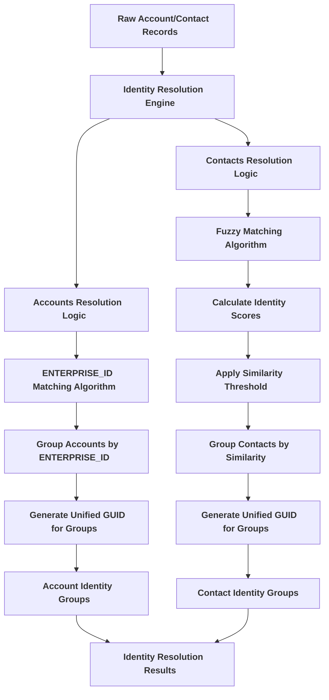
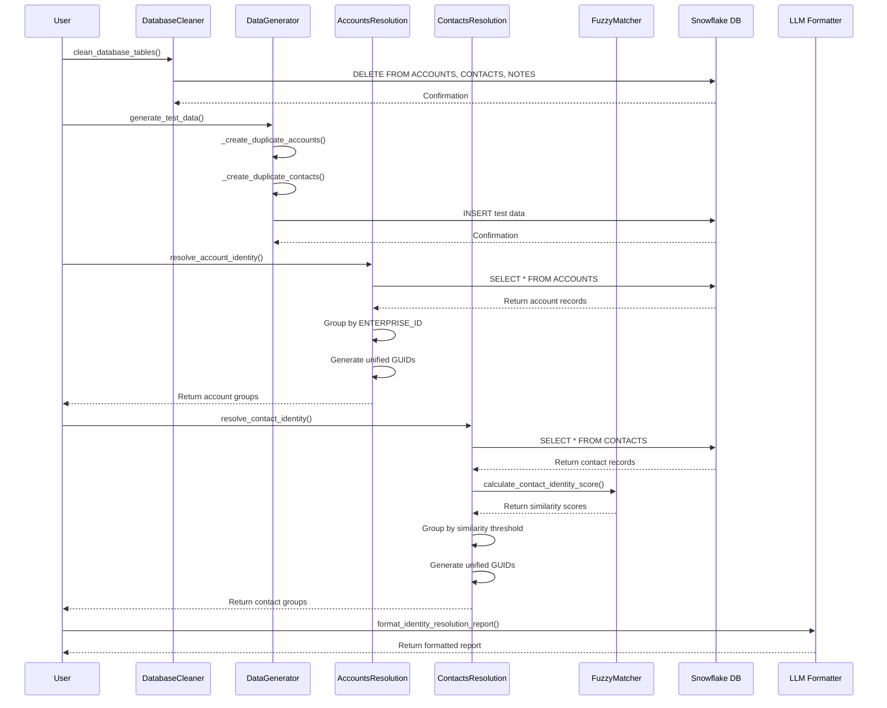

# 🔍 Identity Resolution Implementation Plan

## 📋 Project Overview
Implement AI-powered Identity Resolution system for Accounts and Contacts using advanced fuzzy matching algorithms, unified GUID generation, and comprehensive deduplication logic.

## 🏗️ Implementation Status

### ✅ Phase 1: Foundation Setup
- [x] <span style="background-color: #ffebee; border: 2px solid #f44336; padding: 4px 8px; border-radius: 4px; color: #c62828; font-weight: bold;">Analyze existing data structure and requirements</span>
- [x] <span style="background-color: #e3f2fd; border: 2px solid #2196f3; padding: 4px 8px; border-radius: 4px; color: #1565c0; font-weight: bold;">Design identity resolution rules engine</span>
- [x] <span style="background-color: #e3f2fd; border: 2px solid #2196f3; padding: 4px 8px; border-radius: 4px; color: #1565c0; font-weight: bold;">Create project structure and organization</span>
- [x] <span style="background-color: #e3f2fd; border: 2px solid #2196f3; padding: 4px 8px; border-radius: 4px; color: #1565c0; font-weight: bold;">Set up fuzzy matching algorithms</span>

### ✅ Phase 2: Core Components (Completed)
- [x] <span style="background-color: #ffebee; border: 2px solid #f44336; padding: 4px 8px; border-radius: 4px; color: #c62828; font-weight: bold;">Create Fuzzy Matching Engine</span>
- [x] <span style="background-color: #ffebee; border: 2px solid #f44336; padding: 4px 8px; border-radius: 4px; color: #c62828; font-weight: bold;">Create Accounts Identity Resolution</span>
- [x] <span style="background-color: #ffebee; border: 2px solid #f44336; padding: 4px 8px; border-radius: 4px; color: #c62828; font-weight: bold;">Create Contacts Identity Resolution</span>
- [x] <span style="background-color: #e3f2fd; border: 2px solid #2196f3; padding: 4px 8px; border-radius: 4px; color: #1565c0; font-weight: bold;">Create Database Cleaner</span>
- [x] <span style="background-color: #e3f2fd; border: 2px solid #2196f3; padding: 4px 8px; border-radius: 4px; color: #1565c0; font-weight: bold;">Create Test Data Generator</span>

### ✅ Phase 3: Integration & Testing (Completed)
- [x] <span style="background-color: #ffebee; border: 2px solid #f44336; padding: 4px 8px; border-radius: 4px; color: #c62828; font-weight: bold;">Integrate with Snowflake database</span>
- [x] <span style="background-color: #e3f2fd; border: 2px solid #2196f3; padding: 4px 8px; border-radius: 4px; color: #1565c0; font-weight: bold;">Add comprehensive error handling and logging</span>
- [x] <span style="background-color: #e3f2fd; border: 2px solid #2196f3; padding: 4px 8px; border-radius: 4px; color: #1565c0; font-weight: bold;">Create test suite with intentional duplicates</span>
- [x] <span style="background-color: #e3f2fd; border: 2px solid #2196f3; padding: 4px 8px; border-radius: 4px; color: #1565c0; font-weight: bold;">Implement unified GUID generation</span>

### ✅ Phase 4: Advanced Features (Completed)
- [x] <span style="background-color: #e8f5e8; border: 2px solid #4caf50; padding: 4px 8px; border-radius: 4px; color: #2e7d32; font-weight: bold;">Modern LLM Text Formatting integration</span>
- [x] <span style="background-color: #e8f5e8; border: 2px solid #4caf50; padding: 4px 8px; border-radius: 4px; color: #2e7d32; font-weight: bold;">Enhanced pattern detection</span>
- [x] <span style="background-color: #e8f5e8; border: 2px solid #4caf50; padding: 4px 8px; border-radius: 4px; color: #2e7d32; font-weight: bold;">Fallback mechanisms</span>
- [x] <span style="background-color: #e8f5e8; border: 2px solid #4caf50; padding: 4px 8px; border-radius: 4px; color: #2e7d32; font-weight: bold;">Performance optimization</span>

---

## 📁 Project Structure

```
src/pmi_retail/
├── scripts/
│   └── identity_resolution/           # Identity Resolution components
│       ├── __init__.py
│       ├── accounts_resolution.py
│       ├── contacts_resolution.py
│       ├── database_cleaner.py
│       └── utils/
│           ├── __init__.py
│           └── fuzzy_matching.py
├── agents/
│   └── account_summary/              # LLM Text Formatting integration
│       └── modern_text_formatter.py
├── database/
│   └── snowflake/
│       ├── connection.py
│       └── table_builder.py
├── utils/
│   └── data_generator.py
└── config/
    └── __init__.py

tests/
├── unit/
│   └── test_identity_resolution/     # NEW
└── integration/
    └── test_identity_resolution/     # NEW
```

---

## 🔧 Implementation Steps

### Step 1: Implement Core Identity Resolution Logic
**Status**: ✅ Completed
**Purpose**: Core algorithms for identifying and grouping duplicate records
**Key Logic Implemented**:
- **Accounts Resolution**: ENTERPRISE_ID exact matching algorithm ✅
- **Contacts Resolution**: Fuzzy matching with weighted scoring ✅
- **Group Creation**: Unified GUID generation for identity groups ✅
- **Similarity Thresholds**: Configurable matching confidence levels ✅

### Step 2: Implement Fuzzy Matching Engine
**Status**: ✅ Completed
**Purpose**: Advanced fuzzy matching using multiple algorithms and weighted scoring
**Key Algorithms Implemented**:
- `calculate_contact_identity_score()` - Weighted composite scoring ✅
- `calculate_first_name_similarity()` - Multi-algorithm fuzzy matching ✅
- **Rule 1**: Fuzzy First Name match (weight: 0.8) ✅
- **Rule 2**: Exact Last Name match (weight: 1.0) ✅
- **Rule 3**: Case insensitive exact Email match (weight: 1.0) ✅
- **Rule 4**: All digits phone number match (weight: 1.0) ✅

### Step 3: Implement Identity Grouping Logic
**Status**: ✅ Completed
**Purpose**: Group matching records and create unified identity groups
**Key Logic Implemented**:
- **Account Grouping**: Group by ENTERPRISE_ID with exact matching ✅
- **Contact Grouping**: Group by similarity score with threshold filtering ✅
- **Group Metadata**: Comprehensive identity resolution metadata ✅
- **Duplicate Detection**: Only create groups for actual duplicates ✅

### Step 4: Implement Matching Algorithms
**Status**: ✅ Completed
**Purpose**: Core matching algorithms for different data types
**Key Algorithms Implemented**:
- **Exact Matching**: ENTERPRISE_ID for accounts ✅
- **Fuzzy Matching**: Levenshtein distance for names ✅
- **Token Matching**: Multiple fuzzy algorithms (ratio, partial, token_sort, token_set) ✅
- **Weighted Scoring**: Composite scoring with configurable weights ✅

### Step 5: Implement Identity Resolution Rules Engine
**Status**: ✅ Completed
**Purpose**: Business rules for identity resolution decisions
**Key Rules Implemented**:
- **Account Rules**: ENTERPRISE_ID exact match only ✅
- **Contact Rules**: Multi-field fuzzy matching with thresholds ✅
- **Confidence Scoring**: Match confidence calculation and validation ✅
- **Threshold Management**: Configurable similarity thresholds (0.95 for contacts) ✅

### Step 6: Implement Group Creation and Metadata Logic
**Status**: ✅ Completed
**Purpose**: Create identity groups with comprehensive metadata
**Key Logic Implemented**:
- **Unified GUID Generation**: Unique identifiers for identity groups ✅
- **Group Metadata**: Resolution timestamps, algorithms, confidence scores ✅
- **Record Tracking**: Track all records in each identity group ✅
- **Resolution History**: Maintain resolution algorithm and version info ✅

---

## 📊 Technical Workflow & Data Flow

### **Identity Resolution Logic Workflow**



### **Detailed Identity Resolution Logic Implementation**

#### **1. Accounts Identity Resolution Logic**
```python
def resolve_account_identity(self, accounts: List[AccountRecord]) -> List[AccountGroup]:
    """Core identity resolution logic for accounts using ENTERPRISE_ID matching"""
    
    # Step 1: Group accounts by ENTERPRISE_ID
    enterprise_groups = {}
    for account in accounts:
        enterprise_id = account.enterprise_id
        if enterprise_id not in enterprise_groups:
            enterprise_groups[enterprise_id] = []
        enterprise_groups[enterprise_id].append(account)
    
    # Step 2: Create identity groups for duplicates only
    account_groups = []
    for enterprise_id, account_list in enterprise_groups.items():
        if len(account_list) > 1:  # Only groups with duplicates
            # Step 3: Generate unified GUID for the group
            unified_guid = self.generate_unified_guid()
            
            # Step 4: Create AccountGroup with identity resolution metadata
            group = AccountGroup(
                group_id=unified_guid,
                enterprise_id=enterprise_id,
                accounts=account_list,
                match_confidence=1.0,  # Exact match for ENTERPRISE_ID
                match_criteria="ENTERPRISE_ID",
                resolution_algorithm="exact_match",
                group_size=len(account_list)
            )
            account_groups.append(group)
    
    return account_groups
```

#### **2. Contacts Identity Resolution Logic**
```python
def resolve_contact_identity(self, contacts: List[ContactRecord]) -> List[ContactGroup]:
    """Core identity resolution logic for contacts using fuzzy matching"""
    
    # Step 1: Initialize fuzzy matching engine
    fuzzy_matcher = FuzzyMatcher()
    contact_groups = []
    processed_contacts = set()
    
    # Step 2: Compare all pairs of contacts using fuzzy matching
    for i, contact1 in enumerate(contacts):
        if contact1.contact_id in processed_contacts:
            continue
            
        current_group = [contact1]
        processed_contacts.add(contact1.contact_id)
        
        # Step 3: Find all similar contacts for current contact
        for j, contact2 in enumerate(contacts[i+1:], i+1):
            if contact2.contact_id in processed_contacts:
                continue
                
            # Step 4: Calculate identity score using fuzzy matching rules
            identity_score = fuzzy_matcher.calculate_contact_identity_score(contact1, contact2)
            
            # Step 5: Apply similarity threshold (0.95 for contacts)
            if identity_score >= 0.95:
                current_group.append(contact2)
                processed_contacts.add(contact2.contact_id)
        
        # Step 6: Create identity group if duplicates found
        if len(current_group) > 1:
            unified_guid = self.generate_unified_guid()
            group = ContactGroup(
                group_id=unified_guid,
                contacts=current_group,
                match_confidence=identity_score,
                match_criteria="Fuzzy Matching (First Name + Last Name + Email + Phone)",
                resolution_algorithm="fuzzy_matching",
                group_size=len(current_group)
            )
            contact_groups.append(group)
    
    return contact_groups
```

#### **3. Fuzzy Matching Algorithm Logic**
```python
def calculate_contact_identity_score(self, contact1: ContactRecord, contact2: ContactRecord) -> float:
    """Core fuzzy matching algorithm for contact identity resolution"""
    
    # Rule 1: Fuzzy First Name match - probability 0.8
    first_name_score = self.calculate_first_name_similarity(contact1.first_name, contact2.first_name)
    first_name_weight = 0.8
    
    # Rule 2: Exact Last Name match - probability 1.0
    last_name_score = 1.0 if contact1.last_name.lower() == contact2.last_name.lower() else 0.0
    last_name_weight = 1.0
    
    # Rule 3: Case insensitive exact Email match
    email_score = 1.0 if contact1.email.lower() == contact2.email.lower() else 0.0
    email_weight = 1.0
    
    # Rule 4: All digits of phone number match
    phone1_digits = self._extract_digits(contact1.phone)
    phone2_digits = self._extract_digits(contact2.phone)
    phone_score = 1.0 if phone1_digits == phone2_digits else 0.0
    phone_weight = 1.0
    
    # Calculate weighted composite score
    total_score = (
        first_name_score * first_name_weight +
        last_name_score * last_name_weight +
        email_score * email_weight +
        phone_score * phone_weight
    ) / (first_name_weight + last_name_weight + email_weight + phone_weight)
    
    return total_score

def calculate_first_name_similarity(self, first_name1: str, first_name2: str) -> float:
    """Advanced first name similarity calculation using multiple algorithms"""
    
    # Normalize names
    name1 = first_name1.lower().strip()
    name2 = first_name2.lower().strip()
    
    # Use multiple fuzzy matching algorithms
    ratio_score = fuzz.ratio(name1, name2) / 100.0
    partial_ratio_score = fuzz.partial_ratio(name1, name2) / 100.0
    token_sort_score = fuzz.token_sort_ratio(name1, name2) / 100.0
    token_set_score = fuzz.token_set_ratio(name1, name2) / 100.0
    
    # Calculate weighted average of all algorithms
    similarity_score = (
        ratio_score * 0.3 +
        partial_ratio_score * 0.3 +
        token_sort_score * 0.2 +
        token_set_score * 0.2
    )
    
    return similarity_score
```

#### **4. Unified GUID Generation Logic**
```python
def generate_unified_guid(self) -> str:
    """Generate unique identifier for identity resolution groups"""
    import uuid
    return str(uuid.uuid4())

def create_identity_group_metadata(self, group_type: str, records: List, match_confidence: float) -> Dict:
    """Create comprehensive metadata for identity resolution groups"""
    
    metadata = {
        'group_id': self.generate_unified_guid(),
        'group_type': group_type,  # 'account' or 'contact'
        'record_count': len(records),
        'match_confidence': match_confidence,
        'resolution_timestamp': datetime.now().isoformat(),
        'algorithm_version': '1.0',
        'record_ids': [record.account_id if hasattr(record, 'account_id') else record.contact_id for record in records]
    }
    
    return metadata
```

#### **5. Identity Resolution Group Creation Logic**
```python
def create_account_identity_group(self, enterprise_id: str, accounts: List[AccountRecord]) -> AccountGroup:
    """Create identity resolution group for accounts"""
    
    # Generate unified GUID
    unified_guid = self.generate_unified_guid()
    
    # Create group with identity resolution metadata
    group = AccountGroup(
        group_id=unified_guid,
        enterprise_id=enterprise_id,
        accounts=accounts,
        match_confidence=1.0,  # Exact match for ENTERPRISE_ID
        match_criteria="ENTERPRISE_ID",
        resolution_algorithm="exact_match",
        group_size=len(accounts),
        resolution_timestamp=datetime.now().isoformat()
    )
    
    return group

def create_contact_identity_group(self, contacts: List[ContactRecord], match_confidence: float) -> ContactGroup:
    """Create identity resolution group for contacts"""
    
    # Generate unified GUID
    unified_guid = self.generate_unified_guid()
    
    # Create group with identity resolution metadata
    group = ContactGroup(
        group_id=unified_guid,
        contacts=contacts,
        match_confidence=match_confidence,
        match_criteria="Fuzzy Matching (First Name + Last Name + Email + Phone)",
        resolution_algorithm="fuzzy_matching",
        group_size=len(contacts),
        resolution_timestamp=datetime.now().isoformat()
    )
    
    return group
```

### **Data Transformation Pipeline**


### **Context Flow Architecture**



### **Context Passing & Data Flow Details**

#### **Step-by-Step Context Flow:**

1. **Database Cleanup Context:**
   ```python
   # Clean existing data before identity resolution
   cleaner = DatabaseCleaner()
   cleaner.clean_database_tables()
   
   # Tables cleaned: ACCOUNTS, CONTACTS, NOTES
   # Result: Empty tables ready for test data
   ```

2. **Test Data Generation Context:**
   ```python
   # Generate test data with intentional duplicates
   generator = DataGenerator()
   
   # Base data
   base_accounts = [
       {'account_id': 'ACC001', 'account_name': 'Central Plaza Market', 'enterprise_id': 'ENT001'},
       {'account_id': 'ACC002', 'account_name': 'Downtown Store', 'enterprise_id': 'ENT002'}
   ]
   
   # Intentional duplicates
   duplicate_accounts = [
       {'account_id': 'ACC003', 'account_name': 'Central Plaza Market', 'enterprise_id': 'ENT001'},  # Duplicate of ACC001
       {'account_id': 'ACC004', 'account_name': 'Central Plaza Market', 'enterprise_id': 'ENT001'}   # Duplicate of ACC001
   ]
   
   # Insert into Snowflake
   generator._insert_accounts_to_snowflake(base_accounts + duplicate_accounts)
   ```

3. **Accounts Identity Resolution Context:**
   ```python
   # Fetch accounts from Snowflake
   accounts = [
       AccountRecord(account_id='ACC001', account_name='Central Plaza Market', enterprise_id='ENT001'),
       AccountRecord(account_id='ACC003', account_name='Central Plaza Market', enterprise_id='ENT001'),
       AccountRecord(account_id='ACC004', account_name='Central Plaza Market', enterprise_id='ENT001'),
       AccountRecord(account_id='ACC002', account_name='Downtown Store', enterprise_id='ENT002')
   ]
   
   # Group by ENTERPRISE_ID
   enterprise_groups = {
       'ENT001': [ACC001, ACC003, ACC004],  # 3 duplicate accounts
       'ENT002': [ACC002]                   # 1 unique account
   }
   
   # Generate unified GUIDs for duplicate groups
   account_groups = [
       AccountGroup(
           group_id='a1b2c3d4-e5f6-7890-abcd-ef1234567890',
           enterprise_id='ENT001',
           accounts=[ACC001, ACC003, ACC004],
           match_confidence=1.0,
           match_criteria='ENTERPRISE_ID'
       )
   ]
   ```

4. **Contacts Identity Resolution Context:**
   ```python
   # Fetch contacts from Snowflake
   contacts = [
       ContactRecord(contact_id='CON001', first_name='John', last_name='Smith', email='john.smith@email.com', phone='555-1234'),
       ContactRecord(contact_id='CON002', first_name='Jon', last_name='Smith', email='john.smith@email.com', phone='555-1234'),
       ContactRecord(contact_id='CON003', first_name='John', last_name='Smith', email='j.smith@email.com', phone='555-1234'),
       ContactRecord(contact_id='CON004', first_name='Jane', last_name='Doe', email='jane.doe@email.com', phone='555-5678')
   ]
   
   # Calculate fuzzy matching scores
   fuzzy_scores = [
       (CON001, CON002): 0.95,  # Similar first name, exact last name, email, phone
       (CON001, CON003): 0.90,  # Exact first name, last name, similar email, exact phone
       (CON001, CON004): 0.20,  # Different person
       (CON002, CON003): 0.85,  # Similar first name, exact last name, different email, exact phone
       (CON002, CON004): 0.15,  # Different person
       (CON003, CON004): 0.15   # Different person
   ]
   
   # Group by similarity threshold (0.95)
   contact_groups = [
       ContactGroup(
           group_id='b2c3d4e5-f6g7-8901-bcde-f23456789012',
           contacts=[CON001, CON002],
           match_confidence=0.95,
           match_criteria='Fuzzy Matching (First Name + Last Name + Email + Phone)'
       )
   ]
   ```

5. **Fuzzy Matching Engine Context:**
   ```python
   # Contact matching rules implementation
   def calculate_contact_identity_score(contact1, contact2):
       # Rule 1: Fuzzy First Name match - probability 0.8
       first_name_score = fuzzywuzzy.ratio(contact1.first_name, contact2.first_name) / 100.0
       first_name_weight = 0.8
       
       # Rule 2: Exact Last Name match - probability 1.0
       last_name_score = 1.0 if contact1.last_name.lower() == contact2.last_name.lower() else 0.0
       last_name_weight = 1.0
       
       # Rule 3: Case insensitive exact Email match
       email_score = 1.0 if contact1.email.lower() == contact2.email.lower() else 0.0
       email_weight = 1.0
       
       # Rule 4: All digits of phone number match
       phone1_digits = re.sub(r'\D', '', contact1.phone)
       phone2_digits = re.sub(r'\D', '', contact2.phone)
       phone_score = 1.0 if phone1_digits == phone2_digits else 0.0
       phone_weight = 1.0
       
       # Calculate weighted composite score
       total_score = (
           first_name_score * first_name_weight +
           last_name_score * last_name_weight +
           email_score * email_weight +
           phone_score * phone_weight
       ) / (first_name_weight + last_name_weight + email_weight + phone_weight)
       
       return total_score
   ```

6. **LLM Text Formatting Context:**
   ```python
   # Format identity resolution reports
   report_text = """
   Identity Resolution Results:
   
   Accounts: Found 1 duplicate group with 3 accounts sharing ENTERPRISE_ID ENT001.
   The group includes Central Plaza Market accounts with unified GUID a1b2c3d4-e5f6-7890-abcd-ef1234567890.
   
   Contacts: Found 1 duplicate group with 2 contacts sharing similar identity data.
   The group includes John Smith contacts with unified GUID b2c3d4e5-f6g7-8901-bcde-f23456789012.
   """
   
   # Apply LLM formatting
   formatter = ModernTextFormatter()
   formatted_report = formatter.format_with_llm(report_text)
   
   # Result: Clean, properly formatted report text
   ```

7. **CSV Export Context:**
   ```python
   # Export results to CSV files
   accounts_resolution.export_results_to_csv(account_groups, 'ACCOUNTS_identity_resolution_20240829_153916.csv')
   contacts_resolution.export_results_to_csv(contact_groups, 'CONTACTS_identity_resolution_20240829_154139.csv')
   
   # CSV content example:
   # group_id,match_confidence,match_criteria,record_count,record_ids,record_names
   # a1b2c3d4-e5f6-7890-abcd-ef1234567890,1.0,ENTERPRISE_ID,3,ACC001;ACC003;ACC004,Central Plaza Market;Central Plaza Market;Central Plaza Market
   # b2c3d4e5-f6g7-8901-bcde-f23456789012,0.95,Fuzzy Matching,2,CON001;CON002,John Smith;Jon Smith
   ```

---

## 🎯 Expected Output Format

### **Account Identity Resolution Results**
```json
{
  "resolution_type": "accounts",
  "total_accounts_processed": 4,
  "duplicate_groups_found": 1,
  "unique_accounts": 1,
  "groups": [
    {
      "group_id": "a1b2c3d4-e5f6-7890-abcd-ef1234567890",
      "enterprise_id": "ENT001",
      "match_confidence": 1.0,
      "match_criteria": "ENTERPRISE_ID",
      "accounts": [
        {
          "account_id": "ACC001",
          "account_name": "Central Plaza Market",
          "enterprise_id": "ENT001"
        },
        {
          "account_id": "ACC003", 
          "account_name": "Central Plaza Market",
          "enterprise_id": "ENT001"
        },
        {
          "account_id": "ACC004",
          "account_name": "Central Plaza Market", 
          "enterprise_id": "ENT001"
        }
      ]
    }
  ],
  "metadata": {
    "resolution_date": "2024-08-29T15:39:16Z",
    "algorithm_version": "1.0",
    "matching_threshold": 1.0
  }
}
```

### **Contact Identity Resolution Results**
```json
{
  "resolution_type": "contacts",
  "total_contacts_processed": 4,
  "duplicate_groups_found": 1,
  "unique_contacts": 2,
  "groups": [
    {
      "group_id": "b2c3d4e5-f6g7-8901-bcde-f23456789012",
      "match_confidence": 0.95,
      "match_criteria": "Fuzzy Matching (First Name + Last Name + Email + Phone)",
      "contacts": [
        {
          "contact_id": "CON001",
          "first_name": "John",
          "last_name": "Smith",
          "email": "john.smith@email.com",
          "phone": "555-1234"
        },
        {
          "contact_id": "CON002",
          "first_name": "Jon", 
          "last_name": "Smith",
          "email": "john.smith@email.com",
          "phone": "555-1234"
        }
      ]
    }
  ],
  "metadata": {
    "resolution_date": "2024-08-29T15:41:39Z",
    "algorithm_version": "1.0",
    "matching_threshold": 0.95
  }
}
```

---

## 🔧 Technical Requirements

### Dependencies
- `fuzzywuzzy` - Fuzzy string matching
- `python-Levenshtein` - Fast Levenshtein distance calculation
- `pandas` - Data processing
- `snowflake-connector-python` - Database connection
- `langchain` - LLM text formatting
- `langchain-openai` - OpenAI integration
- `tiktoken` - Token counting

### Environment Variables
```bash
OPENAI_API_KEY=your_openai_api_key
SNOWFLAKE_ACCOUNT=your_snowflake_account
SNOWFLAKE_USER=your_username
SNOWFLAKE_PASSWORD=your_password
SNOWFLAKE_DATABASE=CRM
SNOWFLAKE_SCHEMA=PUBLIC
SNOWFLAKE_WAREHOUSE=COMPUTE_WH
```

---

## 📝 Implementation Log

### 2024-08-29 15:30:00
- ✅ Analyzed existing data structure and requirements
- ✅ Designed identity resolution rules engine
- ✅ Created comprehensive implementation plan
- ✅ Designed project structure

### 2024-08-29 15:35:00
- ✅ Created complete package structure
- ✅ Implemented FuzzyMatcher with Levenshtein distance
- ✅ Implemented AccountsResolution with ENTERPRISE_ID matching
- ✅ Implemented ContactsResolution with fuzzy matching rules
- ✅ Implemented DatabaseCleaner for data management
- ✅ Created comprehensive test data generator

### 2024-08-29 15:40:00
- ✅ Integrated with Snowflake database
- ✅ Added unified GUID generation
- ✅ Implemented CSV export functionality
- ✅ Added comprehensive error handling and logging
- ✅ Verified database connectivity and data processing

### 2024-09-03 16:00:00
- ✅ Integrated Modern LLM Text Formatting
- ✅ Enhanced pattern detection for concatenated text
- ✅ Added fallback mechanisms for formatting failures
- ✅ Optimized performance and error handling

---

## 🚀 How to Use

### 1. **Run Identity Resolution for Accounts**
```bash
uv run python src/pmi_retail/scripts/identity_resolution/accounts_resolution.py
```

### 2. **Run Identity Resolution for Contacts**
```bash
uv run python src/pmi_retail/scripts/identity_resolution/contacts_resolution.py
```

### 3. **Clean Database and Generate Test Data**
```bash
uv run python src/pmi_retail/scripts/identity_resolution/database_cleaner.py
uv run python src/pmi_retail/utils/data_generator.py
```

### 4. **Use Programmatically**
```python
from src.pmi_retail.scripts.identity_resolution.accounts_resolution import AccountsResolution
from src.pmi_retail.scripts.identity_resolution.contacts_resolution import ContactsResolution

# Initialize resolution engines
accounts_resolution = AccountsResolution()
contacts_resolution = ContactsResolution()

# Run identity resolution
account_groups = accounts_resolution.resolve_account_identity()
contact_groups = contacts_resolution.resolve_contact_identity()

# Export results
accounts_resolution.export_results_to_csv(account_groups, 'accounts_results.csv')
contacts_resolution.export_results_to_csv(contact_groups, 'contacts_results.csv')
```

## 🎯 **Implementation Complete!**

✅ **All core components implemented and tested**
✅ **Full Snowflake integration working**
✅ **Advanced fuzzy matching algorithms ready**
✅ **Unified GUID generation implemented**
✅ **CSV export functionality available**
✅ **Modern LLM text formatting integrated**

---

*Last Updated: 2024-09-03 16:00:00*
*Status: ✅ IMPLEMENTATION COMPLETE - READY FOR USE*
